# Amazon SageMaker secure MLOps
The goal of the solution is to demonstrate a deployment of Amazon SageMaker Studio into a secure controlled environment with multi-layer security and implementation of secure MLOps CI/CD pipelines.

This GitHub repository is for the two-part series of blog posts on [AWS Machine Learning Blog](https://aws.amazon.com/blogs/machine-learning/):
- [Secure multi-account model deployment with Amazon SageMaker: Part 1](https://aws.amazon.com/blogs/machine-learning/part-1-secure-multi-account-model-deployment-with-amazon-sagemaker/)
- [Secure multi-account model deployment with Amazon SageMaker: Part 2](https://aws.amazon.com/blogs/machine-learning/part-2-secure-multi-account-model-deployment-with-amazon-sagemaker/)

This solution covers the main four topics:
1. Secure deployment of [Amazon SageMaker Studio](https://aws.amazon.com/sagemaker/studio/) into a new or an existing secure environment (VPC, private subnets, VPC endpoints, security groups). We implement end-to-end data encryption and fine-grained access control
2. Self-service data science environment provisioning based on [AWS Service Catalog](https://aws.amazon.com/servicecatalog/?aws-service-catalog.sort-by=item.additionalFields.createdDate&aws-service-catalog.sort-order=desc) and [AWS CloudFormation](https://aws.amazon.com/cloudformation/)
3. Self-service provisioning of [MLOps project templates](https://docs.aws.amazon.com/sagemaker/latest/dg/sagemaker-projects-templates.html) in Studio
4. MLOps CI/CD automation using [SageMaker projects](https://docs.aws.amazon.com/sagemaker/latest/dg/sagemaker-projects-whatis.html) and [SageMaker Pipelines](https://docs.aws.amazon.com/sagemaker/latest/dg/pipelines.html) for model training and multi-account deployment

[Jump to solution deployment](#deployment)

# MLOps
The goals of implementing MLOps for your AI/ML projects and environment are:
+ Getting ML models to production
+ Operationalization of AI/ML workloads and workflows
+ Create secured, automated, and reproducible ML workflows
+ Manage models with a model registry and data lineage
+ Enable continuous delivery with IaC and CI/CD pipelines
+ Monitor performance and feedback information to your models
+ Providing compliance, security, and cost tools for ML development
+ Increasing collaboration and experimentation

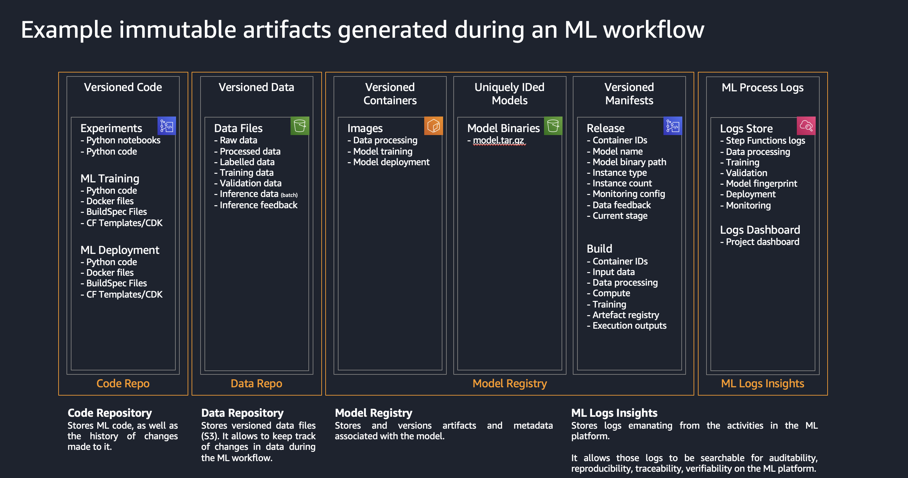

## Model registry
One of the key components of MLOps pipeline in SageMaker is the [model registry](https://docs.aws.amazon.com/sagemaker/latest/dg/model-registry.html).


The model registry provides the following features:
+ Centralized model storage and tracking service that stores lineage, versioning, and related metadata for ML models
+ Stores governance and audit data (e.g. who trained and published the model, which datasets were used)
+ Stores models metrics and when the model was deployed to production
+ Manages model version life cycle
+ Manages the approval status of a model

# Solution architecture
This section describes the overall solution architecture.

## Overview


**1 – AWS Service Catalog**  
The end-to-end deployment of the data science environment is delivered as an [AWS Service Catalog](https://aws.amazon.com/servicecatalog) self-provisioned product. One of the main advantages of using AWS Service Catalog for self- provisioning is that authorized users can configure and deploy available products and AWS resources on their own without needing full privileges or access to AWS services. The deployment of all AWS Service Catalog products happens under a specified service role with the defined set of permissions, which are unrelated to the user’s permissions.

**2 – Amazon SageMaker Studio Domain**  
The Data Science Environment product in the AWS Service Catalog creates an [Amazon SageMaker Studio domain](https://docs.aws.amazon.com/sagemaker/latest/dg/gs-studio-onboard.html), which consists of a list of authorized users, configuration settings, and an Amazon Elastic File System ([Amazon EFS](https://aws.amazon.com/efs/)) volume, which contains data for the users, including notebooks, resources, and artifacts.

**3,4 – SageMaker MLOps project templates**  
The solution delivers the customized versions of [SageMaker MLOps project templates](https://docs.aws.amazon.com/sagemaker/latest/dg/sagemaker-projects-whatis.html). Each MLOps template provides an automated model building and deployment pipeline using continuous integration and continuous delivery (CI/CD). The delivered templates are configured for the secure multi-account model deployment and are fully integrated in the provisioned data science environment. The project templates are provisioned in the Studio via AWS Service Catalog.

**5,6 – CI/CD workflows**  
The MLOps projects implement CI/CD using SageMaker Pipelines and [AWS CodePipeline](https://aws.amazon.com/codepipeline/), [AWS CodeCommit](https://aws.amazon.com/codecommit/), and [AWS CodeBuild](https://aws.amazon.com/codebuild/). SageMaker Pipelines are responsible for orchestrating workflows across each step of the ML process and task automation including data loading, data transformation, training, tuning and validation, and deployment. Each model is tracked via the [SageMaker model registry](https://docs.aws.amazon.com/sagemaker/latest/dg/model-registry.html), which stores the model metadata, such as training and validation metrics and data lineage, manages model versions and the approval status of the model.
This solution supports secure multi-account model deployment using [AWS Organizations](https://aws.amazon.com/organizations/) or via simple target account lists.

**7 – Secure infrastructure**  
Studio domain is deployed in a dedicated VPC. Each [elastic network interface (ENI)](https://docs.aws.amazon.com/AWSEC2/latest/UserGuide/using-eni.html) used by SageMaker domain or workload is created within a private dedicated subnet and attached to the specified security groups. The data science environment VPC can be configured with internet access via an optional [NAT gateway](https://docs.aws.amazon.com/vpc/latest/userguide/vpc-nat-gateway.html). You can also run this VPC in internet-free mode without any inbound or outbound internet access. 
All access to the AWS public services is routed via [AWS PrivateLink](https://docs.aws.amazon.com/vpc/latest/privatelink/endpoint-services-overview.html). Traffic between your VPC and the AWS services does not leave the Amazon network and is not exposed to the public internet.

**8 – Data security**  
All data in the data science environment, which is stored in [Amazon S3 buckets](https://aws.amazon.com/s3/), [Amazon EBS](https://aws.amazon.com/ebs) and EFS volumes, is encrypted at rest using [customer-managed AWK Key Management Service (KMS) keys](https://docs.aws.amazon.com/kms/latest/developerguide/concepts.html#customer-cmk). All data transfer between platform components, API calls, and inter-container communication is protected using Transport Layer Security (TLS 1.2) protocol. 
Data access from the SageMaker Studio notebooks or any SageMaker workload to the environment Amazon S3 buckets is governed by the combination of the [Amazon S3 bucket and user policies](https://docs.aws.amazon.com/AmazonS3/latest/userguide/using-iam-policies.html) and [S3 VPC endpoint policy](https://docs.aws.amazon.com/vpc/latest/privatelink/vpc-endpoints-access.html#vpc-endpoint-policies).


## AWS account, team, and project setup
The following diagram shows the proposed team and AWS account structure for the solution:


The data science environment has a three-level organizational structure: Enterprise (Organizational Unit), Team (Environment), and Project.

+ **Enterprise** level: The highest level in hierarchy, represented by the `DS Administrator` role and _Data Science portfolio_ in AWS Service Catalog. A data science environment per team is provisioned via the AWS Service Catalog self-service into a dedicated data science AWS Account.
+ **Team/Environment** level: There is one dedicated Data Science Team AWS account and one Studio domain per region per AWS account. `DS Team Administrator `can create user profiles in Studio for different user roles with different permissions, and also provision a CI/CD MLOps pipelines per project. The DS Administrator role is responsible for approving ML models and deployment into staging and production accounts. Based on role permission setup you can implement fine-granular separation of rights and duties per project. You can find more details on permission control with IAM policies and resource tagging in the blog post [Configuring Amazon SageMaker Studio for teams and groups with complete resource isolation](https://aws.amazon.com/fr/blogs/machine-learning/configuring-amazon-sagemaker-studio-for-teams-and-groups-with-complete-resource-isolation/) on [AWS Machine Learning Blog](https://aws.amazon.com/blogs/machine-learning/)
+ **Project** level: This is the individual project level and represented by CI/CD pipelines which are provisioned via SageMaker projects in Studio

The recently published AWS whitepaper [Build a Secure Enterprise Machine Learning Platform on AWS](https://docs.aws.amazon.com/whitepapers/latest/build-secure-enterprise-ml-platform/build-secure-enterprise-ml-platform.html) gives detailed overview and outlines the best practices for more generic use case of building multi-account enterprise-level data science environments.

This is a proposed environment structure and can be adapted for your specific requirements, organizational and governance structure, and project methodology.

## Multi-account setup
The best practice for implementing production and real-life data science environment is to use multiple AWS accounts. The multi-account approaches has the following benefits:
- Supports multiple unrelated teams
- Ensures fine-grained security and compliance controls
- Minimizes the blast radius
- Provides workload and data isolation
- Facilitates the billing and improves cost visibility and control
- Separates between development, test, and production 

You can find a recommended multi-account best practices in the whitepaper [Build a Secure Enterprise Machine Learning Platform on AWS](https://docs.aws.amazon.com/whitepapers/latest/build-secure-enterprise-ml-platform/aws-accounts.html).

The solution implements the following multi-account approach:
+ A dedicated AWS account (development account) per Data Science team and one Amazon SageMaker Studio domain per region per account
+ Dedicated AWS accounts for staging and production of AI/ML models
+ Optional usage of AWS Organizations to enable trust and security control policies for member AWS accounts

Without loss of generality, this solution uses three account groups: 
+ **Development** (data science) account: this account is used by data scientists and ML engineers to perform experimentation and development. Data science tools such as Studio is used in the development account. Amazon S3 buckets with data and models, code repositories and CI/CD pipelines are hosted in this account. Models are built, trained, validated, and registered in the model repository in this account. 
+ **Testing/staging/UAT** accounts: Validated and approved models are first deployed to the staging account, where the automated unit and integration tests are run. Data scientists and ML engineers do have read-only access to this account.
+ **Production** accounts: Tested models from the staging accounts are finally deployed to the production account for both online and batch inference.

❗ For real-life production setup we recommend to use additional two account groups:
+ **Shared services** accounts: This account hosts common resources like team code repositories, CI/CD pipelines for MLOps workflows, Docker image repositories, service catalog portfolios, model registries, and library package repositories. 
+ **Data management** accounts: A dedicated AWS account to store and manage all data for the machine learning process. It is recommended to implement strong data security and governance practices using [AWS Data Lake](https://aws.amazon.com/solutions/implementations/data-lake-solution/) and [AWS Lake Formation](https://aws.amazon.com/lake-formation/).

Each of these account groups can have multiple AWS accounts and environments for development and testing of services and storing different type of data.

## User setup
Initial baselines for the IAM roles are taken from [Secure data science reference architecture](https://github.com/aws-samples/secure-data-science-reference-architecture) open source project on GitHub. You can adjust role permission policies based on your specific security guidelines and requirements.

This solution uses the concept of following roles in Model Development Life Cycle (MDLC):  
+  **Data engineer**/**ML Engineer**:
  Responsible for:
    - data sourcing
    - data quality assurance
    - data pre-processing
    - Feature engineering
    - develop data delivery pipelines (from the data source to destination S3 bucket where it is consumed by ML model/Data scientist)

    Permission baseline:
    - Data processing services (DMS, AWS Glue ETL, Athena, Kinesis, EMR, DataBrew, SageMaker, SageMaker Data Wrangler)
    - Data locations (S3, Data Lakes, Lake Formation)
    - Databases (RDS, Aurora, Redshift)
    - BI services (Grafana, Quicksight)
    - SageMaker notebooks

  ❗ This role is out of scope of this solution

+ **Data scientist**:  
  “Project user” role for a DataScientist. This solution implements a wide permission baseline. You might trim the permissions down for your real-life projects to reflect your security environment and requirements. The provisioned role uses the AWS managed permission policy for the job function `DataScientist`:  
    - Model training and evaluation in SageMaker, Studio, Notebooks, SageMaker JumpStart
    - Feature engineering
    - Starting ML pipelines
    - Deploy models to the model registry
    - GitLab permissions

    Permission baseline:
    - AWS managed policy `DataScientist`
    - Data locations (S3): only a defined set of S3 buckets (e.g. Data and Model)
    - SageMaker, Studio, Notebooks

    Role definition: [CloudFormation](cfn_templates/env-iam.yaml)

+ **Data science team administrator**:  
   This is the admin role for a team or data science environment. In real-life setup you might want to add one more level of hierarchy and add an administrator role per project (or group of projects) – it creates a separation of duties between projects and minimize the blast radius. In this solution we are going to have one administrator role per team or "environment", effectively meaning that Project Administrator = Team Administrator. The main responsibilities of the role are:  
    - ML infrastructure management and operations (endpoints, monitoring, scaling, reliability/high availability, BCM/DR)
    - Model hosting
    - Production integration
    - Model approval for deployment in staging and production
    - Project template (MLOps) provisioning
    - Provision products via AWS Service Catalog
    - GitLab repository access

    Permission baseline:
    - PROD account
    - ML infrastructure
    - Data locations (S3)

    Role definition: [CloudFormation](cfn_templates/env-iam.yaml)

+ **Data science administrator**:  
  This is overarching admin role for the data science projects and setting up the secure SageMaker environment. It uses AWS managed policies only. This role has the following responsibilities:
    - Provisioning of the shared data science infrastructure
    - Model approval for production
    - Deploys data science environments via the AWS Service Catalog

    Permission baseline:
    - Approvals (MLOps, Model registry, CodePipeline)
    - Permissions to deploy products from AWS Service Catalog  

    Role definition: [CloudFormation](cfn_templates/core-iam-shared-roles.yaml)

A dedicated IAM role is created for each persona/user. For a real-life project we recommend to start with a least possible permission set and add necessary permissions based on your security requirements and data science environment settings. 

## IAM setup
The following diagram shows the provisioned IAM roles for personas/users and execution roles for services:


More information and examples about the best practices and security setup for multi-project and multi-team environments you can find in the blog post [Configuring Amazon SageMaker Studio for teams and groups with complete resource isolation](https://aws.amazon.com/fr/blogs/machine-learning/configuring-amazon-sagemaker-studio-for-teams-and-groups-with-complete-resource-isolation/) on [AWS Machine Learning Blog](https://aws.amazon.com/blogs/machine-learning/).

### Multi-account setup for IAM roles
For this solution we use three AWS Organizations organizational units (OUs) to simulate development, staging, and production environments. The following section describes how the IAM roles should be mapped to the accounts in the OUs.

#### IAM role to account mapping
**DEV account**:
  + All three IAM user roles must be created in the development (data science) account: `DataScienceAdministratorRole`, `DataScienceProjectAdministratorRole`, `DataScientistRole`

  - **DataScienceAdministratorRole**: overall management of Data Science projects via AWS Service Catalog. Management of the AWS Service Catalog. Deployment of a Data Science environment (VPC, subnets, S3 bucket) to an AWS account
  - **DataScientistRole**: Data Scientist role within a specific project. Provisioned on per-project and per-stage (dev/test/prod) basis
  - **DataScienceTeamAdministratorRole**: Administrator role within a specific team or environment

### IAM execution roles
The following IAM execution roles will be provisioned in the development account:
  + `SageMakerDetectiveControlExecutionRole`: for Lambda function to implement responsive/detective security controls
  + `SCLaunchRole`: for AWS Service Catalog to deploy a new Studio domain
  + `SageMakerExecutionRole`: execution role for the SageMaker workloads and Studio
  + `SageMakerPipelineExecutionRole`: execution role for SageMaker Pipelines
  + `SageMakerModelExecutionRole`: execution role for SageMaker model endpoint, will be created in each of dev, stating and production accounts
  + `SCProjectLaunchRole`: for AWS Service Catalog to deploy project-specific products (such as SageMaker Notebooks)
  + `AmazonSageMakerServiceCatalogProductsUseRole`: for SageMaker CI/CD execution (CodeBuild and CodePipeline)
  + `AmazonSageMakerServiceCatalogProductsLaunchRole`: for SageMaker MLOps project templates deployments via AWS Service Catalog
  + `VPCFlowLogsRole`: optional role for VPC Flow Logs to write logs into a CloudWatch log group

#### Staging and production accounts
The following roles should be created in each of the accounts in the staging and production environments:
+ `ModelExecutionRole`: SageMaker uses this role to run inference endpoints and access the model artifacts during the provisioning of the endpoint. This role must have a trust policy for `sagemaker.amazonaws.com` service
+ `StackSetExecutionRole`: used for CloudFormation stack set operations in the staging and production accounts. This role is assumed by `StackSetAdministrationRole` in the development account
+ `SetupStackSetExecutionRole`: this role is needed for stack set operations for the initial provisioning of the data science environment in multi-account deployment use case

## Multi-account ML model deployment
To use multi-account ML model deployment with this solution, you have two options how to provide staging and production accounts ids: 
- use AWS Organizations organizational units (OUs)
- use AWS account lists

### Option 1: OU setup for multi-account deployment
This solution can use a multi-account AWS environment setup in [AWS Organizations](https://aws.amazon.com/organizations/). Organizational units (OUs) should be based on function or common set of controls rather than mirroring company’s reporting structure.

If you use an AWS Organization setup option, you must provide **two organizational unit ids** (OU ids) for the staging and production unit and setup the data science account as the **delegated administrator** for AWS Organizations.

Your AWS Organizations structure can look like the following:
```
Root
`--- OU SageMaker PoC
      |--- Data Science account (development)
      `----OU Staging
            |--- Staging accounts
      `----OU Production
            |--- Production accounts
```

Please refer to the [Deployment section](#deployment) for the details how to setup the delegated administrator.

### Option 2: provide account list for multi-account deployment
Use of AWS Organizations is not needed for a multi-account MLOps setup. The same permission logic and account structure can be implemented with IAM cross-account permissions without need for AWS organizations. This solution also works without AWS Organizations setup. You can provide **lists with staging and production AWS account ids** during the provisioning of the data science environment.

Please refer to the [Deployment section](#deployment) for the description of corresponding CloudFormation parameters.

### Single-account setup
The solution also implements full MLOps functionality with single-account setup. All examples, workflows and pipelines work in the single (development) data science account. We do not recommend to use a single-account setup for any production use of SageMaker and Studio, but for testing and experimentation purposes it is a fast and cost-effective option to choose.

## SageMaker secure deployment in VPC 
The following deployment architecture is implemented by this solution:


The main design principles and decisions are:
+ SageMaker Studio domain is deployed in a dedicated VPC. Each [elastic network interface (ENI)](https://docs.aws.amazon.com/AWSEC2/latest/UserGuide/using-eni.html) used by SageMaker domain is created within a private dedicated subnet and attached to the specified security groups
+ `Data Science Team VPC` can be configured with internet access by attaching a **NAT gateway**. You can also run this VPC in internet-free mode without any inbound or outbound internet access
+ All access to S3 is routed via S3 VPC endpoints
+ All access to SageMaker API and runtime and the all used AWS public services is routed via VPC endpoints
+ A PyPI repository mirror running on Fargate is hosted within your network to provide a python package repository in internet-free mode (_not implemented in this version_)
+ AWS Service Catalog is used to deploy a data science environment and SageMaker project templates
+ All user roles are deployed into Data Science account IAM
+ Provisioning of all IAM roles is completely separated from the deployment of the data science environment. You can use your own processes to provision the needed IAM roles.


## AWS Service Catalog approach
All self-provisioned products in this solution such as Data Science environment, Studio user profile, SageMaker Notebooks, and MLOps project templates are delivered and deployed via [AWS Service Catalog](https://aws.amazon.com/servicecatalog).

One of the main advantages of using AWS Service Catalog for self-service provisioning is that users can configure and deploy configured products and AWS resources without needing full privileges to AWS services. The deployment of all AWS Service Catalog products happens under a specified service role with the defined set of permissions.

The Service Catalog approach offers the following features:

+ Product definition via CloudFormation templates following best-practices and compliance requirements
+ Control access to underlying AWS services
+ Self-service product provisioning for the entitled end users
+ Implement technology recommendations and patterns
+ Provide security and information privacy guardrails

**Governed and secure environments** are delivered via AWS Service Data catalog:
+ Research and train ML models
+ Share reproducible results
+ Develop data processing automation
+ Develop ML model training automation
+ Define ML Deployment resources
+ Test ML models before deployment


## AWS Service Catalog products in this solution
The following sections describe products which are delivered as part of this solution.

### Data science environment product
This product provisions end-to-end data science environment (Studio) for a specific Data Science team (Studio Domain) and stage (dev/test/prod). It deploys the following team- and stage-specific resources:
  + VPC:
    - Dedicated `Data Science Team VPC`
    - Private subnets in each of the selected Availability Zones (AZ), up to four AZs are supported
    - If NAT gateway option is selected: NAT gateways and public subnets in each of the selected AZs 
  + VPC endpoints:
    - S3 VPC endpoint (`gateway` type) and endpoint policy to access the S3 data and model buckets. Only data and model buckets can be accessed
    - VPC endpoints (`interface` type) to access AWS public services (CloudWatch, SSM, SageMaker, CodeCommit)
    - VPC endpoint to access the `Shared services VPC`
  + Security Groups:
    - SageMaker security group for SageMaker resources. No ingress allowed
    - VPC endpoint security group for all VPC endpoints. **HTTPS 443 ingress only**
    - VPC endpoint security group to access the `Shared services VPC`. **HTTP 80 ingress only**
  + IAM roles:
    - Data Scientist IAM role
    - Data Science team administrator IAM role
  + AWS KMS:
    - KMS key for data encryption in S3 buckets
    - KMS key for data encryption on EBS volumes attached to SageMaker instances (for training, processing, batch jobs)
  + Amazon S3 buckets:
    - Amazon S3 data bucket with a pre-defined bucket policy. The S3 bucket is encrypted with AWS KMS key.
    - Amazon S3 model bucket with a pre-defined bucket policy. The S3 bucket is encrypted with AWS KMS key

### Team-level products

#### SageMaker MLOps project templates
This solution deploys two [SageMaker projects](https://docs.aws.amazon.com/sagemaker/latest/dg/sagemaker-projects-whatis.html) as Service Catalog products:
+ Multi-account model deployment
+ Model building, training, and validating with SageMaker Pipelines

These products are available as SageMaker projects in Studio and only deployable from the Studio.


#### User profile for Studio domain (_not implemented in this version_)
Each provisioning of a Data Science environment product creates a Studio domain with a _default user profile_. You can optionally manually (from AWS CLI or SageMaker console) create new user profiles:

+ Each user profile has its own dedicated compute resource with a slice of the shared EFS file system
+ Each user profile can be associated with its own execution role (or use default domain execution role)

❗ There is a limit of one SageMaker domain per region per account and you can provision only one Data Science environment product per region per account.

#### SageMaker notebook product (_not implemented in this version_)
This product is available for Data Scientist and Data Science Team Administrator roles. Each notebook is provisioned with pre-defined lifecycle configuration. The following considerations are applied to the notebook product:
+ Only some instance types are allowed to use in the notebook
+ Pre-defined notebook execution role is attached to the notebook
+ Notebook execution role enforce use of security configurations and controls (e.g. the notebook can be started only in VPC attachment mode)
+ Notebook has write access only to the project-specific S3 buckets (data and model as deployed by the Data Science Environment product)
+ Notebook-attached EBS volume is encrypted with its own AWS KMS key
+ Notebook is started in the SageMaker VPC, subnet, and security group

## MLOps CI/CD pipelines
Functional MLOps architecture based on [SageMaker MLOps Project templates](https://docs.aws.amazon.com/sagemaker/latest/dg/sagemaker-projects-templates.html) as described in [Building, automating, managing, and scaling ML workflows using Amazon SageMaker Pipelines](https://aws.amazon.com/blogs/machine-learning/building-automating-managing-and-scaling-ml-workflows-using-amazon-sagemaker-pipelines/) and [Multi-account model deployment with Amazon SageMaker Pipelines](https://aws.amazon.com/blogs/machine-learning/multi-account-model-deployment-with-amazon-sagemaker-pipelines/) blog posts on the [AWS Machine Learning Blog](https://aws.amazon.com/blogs/machine-learning/).  

The following diagram shows the MLOps architecture which is implemented by this solution and delivered via MLOps SageMaker project templates:


The main design principles are:
+ MLOps project templates are deployed via Studio
+ Dedicated IAM user and execution roles used to perform assigned actions/tasks in the environment
+ All project artifacts are connected via SageMaker ProjectId ensuring a strong data governance and lineage
+ Multi-account deployment approach is used for secure deployment of your SageMaker models

See more details in the [MLOps projects](#mlops-projects) section.

## Security
This section describes security controls and best practices implemented by the solution.

### Compute and network isolation
+ All network traffic is transferred over private and secure network links
+ All ingress internet access is blocked for the private subnets and only allowed for NAT gateway route
+ Optionally you can block all internet egress creating a completely internet-free secure environment
+ SageMaker endpoints with a trained, validated, and approved model are hosted in dedicated staging and production accounts in your private VPC

### Authentication
+ All access is managed by IAM and can be compliant with your corporate authentication standards
+ All user interfaces can be integrated with your Active Directory or SSO system

### Authorization
+ Access to any resource is disabled by default (implicit deny) and must be explicitly authorized in permission or resource policies
+ You can limit access to data, code and training resources by role and job function

### Data protection
+ All data is encrypted in-transit and at-rest using [customer-managed AWS KMS keys](https://docs.aws.amazon.com/kms/latest/developerguide/concepts.html#customer-cmk)

### Artifact management
+ You can block access to public libraries and frameworks
+ Code and model artifacts are securely persisted in CodeCommit repositories

### Auditability
+ The solution can provide end-to-end auditability with [AWS CloudTrail](https://aws.amazon.com/cloudtrail/), [AWS Config](https://aws.amazon.com/config/), and [Amazon CloudWatch](https://aws.amazon.com/cloudwatch/)
+ Network traffic can be captured at individual network interface level

### Security controls

#### Preventive
We use an IAM role policy which enforce usage of specific security controls. For example, all SageMaker workloads must be created in the VPC with specified security groups and subnets:
```json
{
    "Condition": {
        "Null": {
            "sagemaker:VpcSubnets": "true"
        }
    },
    "Action": [
        "sagemaker:CreateNotebookInstance",
        "sagemaker:CreateHyperParameterTuningJob",
        "sagemaker:CreateProcessingJob",
        "sagemaker:CreateTrainingJob",
        "sagemaker:CreateModel"
    ],
    "Resource": [
        "arn:aws:sagemaker:*:<ACCOUNT_ID>:*"
    ],
    "Effect": "Deny"
}
```
[List of IAM policy conditions for Amazon SageMaker](https://docs.aws.amazon.com/service-authorization/latest/reference/list_amazonsagemaker.html). For more examples, refer to the [developer guide](https://docs.aws.amazon.com/sagemaker/latest/dg/security_iam_id-based-policy-examples.html).

We use an Amazon S3 bucket policy explicitly denies all access which is **not originated** from the designated S3 VPC endpoints:
```json
{
    "Version": "2008-10-17",
    "Statement": [
        {
            "Effect": "Deny",
            "Principal": "*",
            "Action": [
                "s3:GetObject",
                "s3:PutObject",
                "s3:ListBucket"
            ],
            "Resource": [
                "arn:aws:s3:::<s3-bucket-name>/*",
                "arn:aws:s3:::<s3-bucket-name>"
            ],
            "Condition": {
                "StringNotEquals": {
                    "aws:sourceVpce": ["<s3-vpc-endpoint-id1>", "<s3-vpc-endpoint-id2>"]
                }
            }
        }
    ]
}
```

S3 VPC endpoint policy allows access only to the specified S3 project buckets with data, models and CI/CD pipeline artifacts, SageMaker-owned S3 bucket and S3 objects which are used for product provisioning.

#### Detective
_Not implemented in this version_

#### Responsive
_Not implemented in this version_

# MLOps projects
This solution delivers two MLOps projects as SageMaker project templates:
- Model build, train, and validate pipeline
- Multi-account model deploy pipeline

These projects are fully functional examples which are integrated with existing multi-layer security controls such as VPC, subnets, security groups, AWS account boundaries, and the dedicated IAM execution roles. 

## MLOps project template to build, train, validate the model
The solution is based on the [SageMaker project template](https://docs.aws.amazon.com/sagemaker/latest/dg/sagemaker-projects-templates-sm.html) for model building, training, and deployment. You can find in-depth review of this MLOps project in [Building, automating, managing, and scaling ML workflows using Amazon SageMaker Pipelines](https://aws.amazon.com/blogs/machine-learning/building-automating-managing-and-scaling-ml-workflows-using-amazon-sagemaker-pipelines/) on the [AWS Machine Learning Blog](https://aws.amazon.com/blogs/machine-learning/).

The following diagram shows the functional components of the MLOps project.


This project provisions the following resources as part of a MLOps pipeline:
1. The MLOps template is made available through SageMaker projects and is provided via an AWS Service Catalog portfolio 
2. CodePipeline pipeline with two stages - `Source` to get the source code and `Build` to build and execute the SageMaker pipeline
3. SageMaker pipeline implements a repeatable workflow which processes the data, trains, validates, and register the model
4. Seed code repository in CodeCommit:
  - This repository provides seed code to create a multi-step model building pipeline including the following steps: data processing, model training, model evaluation, and conditional model registration based on model accuracy. As you can see in the `pipeline.py` file, this pipeline trains a linear regression model using the [XGBoost algorithm](https://docs.aws.amazon.com/sagemaker/latest/dg/xgboost.html) on the well-known [UCI Abalone dataset](https://archive.ics.uci.edu/ml/datasets/abalone). This repository also includes a [build specification file](https://docs.aws.amazon.com/codebuild/latest/userguide/build-spec-ref.html), used by CodePipeline and CodeBuild to run the pipeline automatically

### Work with Model build, train, and validate project
You can find a step-by-step instruction, implementation details, and usage patterns of the model building pipeline project in the provided notebook [`sagemaker-pipeline.ipynb`](mlops-seed-code/model-build-train/sagemaker-pipeline.ipynb) and [`sagemaker-pipelines-project.ipynb`](mlops-seed-code/model-build-train/sagemaker-pipelines-project.ipynb) files, delivered as part of the seed code.

To deploy the notebooks into your local environment, you must clone the CodeCommit repository with the seed code after you have deployed the SageMaker project into the Studio. Go to the project overview page, select the `Repositories` tab and click the `clone repo...` link:


After the clone operation finished, you can browse the repository files in Studio File view:


You can open the notebook and start experimenting with SageMaker Pipelines.

## MLOps project template for multi-account model deployment
The following diagram shows the functional components of the MLOps project.


This MLOps project consists of the following parts:
1. The MLOps project template deployable through SageMaker project in Studio
2. CodeCommit repository with seed code 
3. Model deployment multi-stage CodePipeline pipeline
4. Staging AWS account (can be the same account as the data science account)
5. Production AWS account (can be the same account as the data science account)
6. SageMaker endpoints with an approved model [hosted in your private VPC](https://docs.aws.amazon.com/sagemaker/latest/dg/host-vpc.html)

The following diagram shows how the trained and approved model is deployed into the target accounts.


After model training and validation, the model is registered in the [model registry](https://docs.aws.amazon.com/sagemaker/latest/dg/model-registry.html). Model registry stores the model metadata, and all model artifacts are stored in an S3 bucket (step **1** in the preceding diagram). The CI/CD pipeline uses CloudFormation stack sets **(2)** to deploy the model in the target accounts. The CloudFormation service assume the role `StackSetExecutionRole` **(3)** in the target account to perform the deployment. SageMaker also assumes the `ModelExecutionRole` **(4)** to access the model metadata and download the model artifacts from the S3 bucket. The `StackSetExecutionRole` must have `iam:PassRole` permission **(5)** for `ModelExecutionRole` to be able to pass the role successfully. Finally, the model is deployed to a SageMaker endpoint **(6)**.

To access the model artifacts and a KMS encryption key an additional cross-account permission setup is needed in case of the multi-account deployment:


All access to the model artifacts happens via the S3 VPC endpoint **(1)**. This VPC endpoint allows access to the model and data S3 buckets. The model S3 bucket policy **(2)** grant access to the ModelExecutionRole principals **(5)** in each of the target accounts.

```json
"Sid": "AllowCrossAccount",
"Effect": "Allow",
"Principal": {
    "AWS": [
            "arn:aws:iam::<staging-account>:role/SageMakerModelExecutionRole",
            "arn:aws:iam::<prod-account>:role/SageMakerModelExecutionRole",
            "arn:aws:iam::<dev-account>:root"
        ]
}
```

We apply the same setup for the data encryption key **(3)**, whose policy **(4)** grant access to the principals in the target accounts. 
SageMaker model-hosting endpoints are placed in a VPC **(6)** in each of the target accounts. Any access to S3 buckets and KMS keys happens via the corresponding VPC endpoints. The IDs of these VPC endpoints are added to the Condition statement of the S3 bucket and KMS keys resource policies.

```json
"Sid": "DenyNoVPC",
"Effect": "Deny",
"Principal": "*",
"Action": [
    "s3:GetObject",
    "s3:PutObject",
    "s3:ListBucket",
    "s3:GetBucketAcl",
    "s3:GetObjectAcl",
    "s3:PutBucketAcl",
    "s3:PutObjectAcl"
    ],
    "Resource": [
        "arn:aws:s3:::sm-mlops-dev-us-east-1-models/*",
        "arn:aws:s3:::sm-mlops-dev-us-east-1-models"
    ],
    "Condition": {
         "StringNotEquals": {
              "aws:sourceVpce": [
                   "vpce-0b82e29a828790da2",
                   "vpce-07ef65869ca950e14",
                   "vpce-03d9ed0a1ba396ff5"
                    ]
         }
    }
```

### Multi-account model deployment prerequisites
Multi-account model deployment can use the AWS Organizations setup to deploy model to the staging and production organizational units (OUs) **or** provided staging and production account lists. For a proper functioning of the **multi-account** deployment process, you must configure the cross-account access and specific execution roles in the target accounts.

#### Execution roles
Execution roles `SageMakerModelExecutionRole` and `StackSetExecutionRole` must be deployed in all target accounts. Target accounts are accounts where models are deployed. These accounts are member of the staging and production OUs or provided in the staging and production account lists at data science environment provisioning time.
  
These execution roles are deployed to the target accounts automatically during the provisioning of the data science environment if the parameter `CreateEnvironmentIAMRoles` is set to `YES`. If this parameter is set to `NO`, you are responsible for provisioning of the execution roles in all target accounts. Refer to [`predeploy-iam-setup.md'](predeploy-iam-setup.md) for step-by-step instructions. 

The model execution role `SageMakerModelExecutionRole` in the staging and production accounts is assumed by `AmazonSageMakerServiceCatalogProductsUseRole` in the data science environment account to test the endpoints in the target accounts. 

_Alternatively_ you can choose to use single-account deployment. In this case the ML model will be deployed in the data science account (Studio account). You do not need to setup target account execution roles and provide OU IDs or account lists as deployment parameters.

❗ If you use single-account deployment, the `MultiAccountDeployment` variable for MLOps Model Deploy project must be set to `NO`:


### Model deployment prerequisites
The following prerequisites are common for both single- and multi-account deployment. **These prerequisites are automatically provisioned if you use provided CLoudFormation templates.**

+ SageMaker must be configured with **at least two subnets in two AZs**, otherwise the SageMaker endpoint deployment will fail as it requires at least two AZs to deploy an endpoint
+ CI/CD pipeline with model deployment uses [AWS CloudFormation StackSets](https://docs.aws.amazon.com/AWSCloudFormation/latest/UserGuide/stacksets-getting-started.html). It requires two IAM service roles created or provided (in case of the BYO IAM role option):
  - `StackSetAdministrationRole`: This role must exist in the **data science account** and used to perform administration stack set operations in the data science account. The `AmazonSageMakerServiceCatalogProductsUseRole` must have `iam:PassRole` permission for this role
  - `StackSetExecutionRole`: This role must exist in the data science account and **each of the target accounts** in staging and production environments. This role is assumed by `StackSetAdministrationRole` to perform stack set operations in the target accounts. This role must have `iam:PassRole` permission for the model execution role `SageMakerModelExecutionRole`

### Work with Model deployment project
You can find step-by-step instructions, implementation details, and usage patterns of multi-account model deployment in the provided [notebook](mlops-seed-code/model-deploy/sagemaker-model-deploy.ipynb).

## Provision a new MLOps project
Sign in to the console with the data scientist account. On the [SageMaker console](https://console.aws.amazon.com/sagemaker/home?region=us-east-1#/dashboard), open Studio with your user profile (default name is `<environment name>-<environment type>-<region>-user-profile`). 

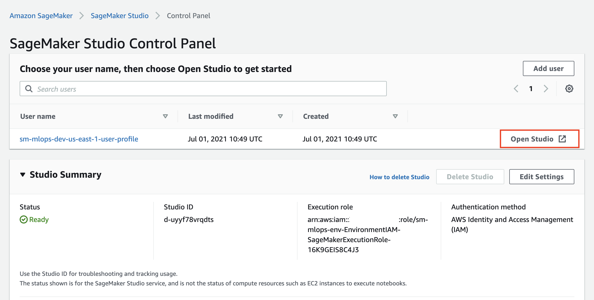

In the Studio:
1. Choose the **Components and registries**
2. On the drop-down menu, choose **Projects**
3. Choose **Create project**
4. Choose **Organization templates**
5. Choose a project template from the list


## CodeCommit seed code
Each of the delivered MLOps projects contains a seed code which is deployed as project's CodeCommit repository.  

The seed repository contains fully functional source code used by the CI/CD pipeline for model building, training, and validating, or for multi-project model deployment. Refer to `README.md` for each of the provided projects.

To work with the seed repository source code you must clone the repository into your Studio environment.
If you would like to develop the seed code and update the MLOps project templates with new version of the code, refer to the [Appendix G](#appendix-g)

## Clean up after working with MLOps project templates
After you have finished working and experimenting with MLOps projects you should perform clean up of the provisioned SageMaker resources to avoid charges.
The following billable resources should be removed:
- CloudFormation stack sets with model deployment (in case you run Model deploy pipeline)  
  This will delete provisioned SageMaker endpoints and associated resources
- SageMaker projects and corresponding S3 buckets with project artifacts
- Any data in the data and model S3 buckets

For the full clean-up CLI script refer to the `Clean up` section in the delivered [shell script](test/cfn-test-e2e.sh).

❗ **This is a destructive action. All data on in Amazon S3 buckets for MLOps pipelines, ML data, and ML models will be permanently deleted. All MLOps project seed code repositories will be permanently removed from your AWS environment.**

### Clean up with Studio notebook
The provided notebooks for MLOps projects - [sagemaker-model-deploy](mlops-seed-code/model-deploy/sagemaker-model-deploy.ipynb) and [sagemaker-pipelines-project](mlops-seed-code/model-build-train/sagemaker-pipelines-project.ipynb) - include clean-up code to remove created resources such as SageMaker projects, SageMaker endpoints, CloudFormation stack sets, and S3 bucket. Run the code cells in the _Clean up_ section after you finished experimenting with the project:
```python
import time

cf = boto3.client("cloudformation")

for ss in [
        f"sagemaker-{project_name}-{project_id}-deploy-{env_data['EnvTypeStagingName']}",
        f"sagemaker-{project_name}-{project_id}-deploy-{env_data['EnvTypeProdName']}"
        ]:
    accounts = [a["Account"] for a in cf.list_stack_instances(StackSetName=ss)["Summaries"]]
    print(f"delete stack set instances for {ss} stack set for the accounts {accounts}")
    r = cf.delete_stack_instances(
        StackSetName=ss,
        Accounts=accounts,
        Regions=[boto3.session.Session().region_name],
        RetainStacks=False,
    )
    print(r)

    time.sleep(180)

    print(f"delete stack set {ss}")
    r = cf.delete_stack_set(
        StackSetName=ss
    )
```

```python
print(f"Deleting project {project_name}:{sm.delete_project(ProjectName=project_name)}")
```

```sh
!aws s3 rb s3://sm-mlops-cp-{project_name}-{project_id} --force
```

### CLI commands to perform clean up
Alternatively, you can run the commands in [shell script](test/cfn-test-e2e.sh) to clean up resources of multiple projects.

After completion of all clean-up steps for MLOps projects you can proceed with [data science environment clean-up steps](#clean-up).

## Test secure S3 access
To verify the access to the Amazon S3 buckets for the data science environment, you can run the following commands in the Studio terminal:

```sh
aws s3 ls
```


The S3 VPC endpoint policy blocks access to S3 `ListBuckets` operation.

```sh
aws s3 ls s3://<sagemaker deployment data S3 bucket name>
```


You can access the data science environment's data or models S3 buckets.

```sh
aws s3 mb s3://<any available bucket name>
```


The S3 VPC endpoint policy blocks access to any other S3 bucket.

```sh
aws sts get-caller-identity
```


All operations are performed under the SageMaker execution role.

## Test preventive IAM policies
Try to start a training job without VPC attachment:
```python
container_uri = sagemaker.image_uris.retrieve(region=session.region_name, 
                                              framework='xgboost', 
                                              version='1.0-1', 
                                              image_scope='training')

xgb = sagemaker.estimator.Estimator(image_uri=container_uri,
                                    role=sagemaker_execution_role, 
                                    instance_count=2, 
                                    instance_type='ml.m5.xlarge',
                                    output_path='s3://{}/{}/model-artifacts'.format(default_bucket, prefix),
                                    sagemaker_session=sagemaker_session,
                                    base_job_name='reorder-classifier',
                                    volume_kms_key=ebs_kms_id,
                                    output_kms_key=s3_kms_id
                                   )

xgb.set_hyperparameters(objective='binary:logistic',
                        num_round=100)

xgb.fit({'train': train_set_pointer, 'validation': validation_set_pointer})
```


You will get `AccessDeniedException` because of the explicit `Deny` in the IAM policy:

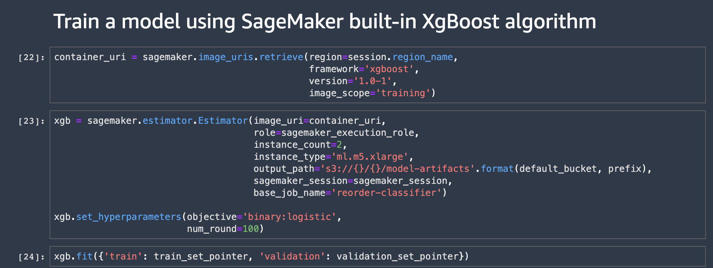


IAM policy:
```json
{
    "Condition": {
        "Null": {
            "sagemaker:VpcSubnets": "true",
            "sagemaker:VpcSecurityGroup": "true"
        }
    },
    "Action": [
        "sagemaker:CreateNotebookInstance",
        "sagemaker:CreateHyperParameterTuningJob",
        "sagemaker:CreateProcessingJob",
        "sagemaker:CreateTrainingJob",
        "sagemaker:CreateModel"
    ],
    "Resource": [
        "arn:aws:sagemaker:*:<ACCOUNT_ID>:*"
    ],
    "Effect": "Deny"
}
```

Now add the secure network configuration to the `Estimator`:
```python
network_config = NetworkConfig(
        enable_network_isolation=False, 
        security_group_ids=env_data["SecurityGroups"],
        subnets=env_data["SubnetIds"],
        encrypt_inter_container_traffic=True)
```

```python
xgb = sagemaker.estimator.Estimator(
    image_uri=container_uri,
    role=sagemaker_execution_role, 
    instance_count=2, 
    instance_type='ml.m5.xlarge',
    output_path='s3://{}/{}/model-artifacts'.format(default_bucket, prefix),
    sagemaker_session=sagemaker_session,
    base_job_name='reorder-classifier',

    subnets=network_config.subnets,
    security_group_ids=network_config.security_group_ids,
    encrypt_inter_container_traffic=network_config.encrypt_inter_container_traffic,
    enable_network_isolation=network_config.enable_network_isolation,
    volume_kms_key=ebs_kms_id,
    output_kms_key=s3_kms_id

  )
```

You will be able to create and run the training job

# Deployment

## Prerequisites
To deploy the solution, you must have **Administrator** (or **Power User**) permissions to package the CloudFormation templates, upload templates in your Amazon S3 bucket, and run the deployment commands.

You must also have [AWS CLI](https://aws.amazon.com/cli/). If you do not have it, see [Installing, updating, and uninstalling the AWS CLI](https://docs.aws.amazon.com/cli/latest/userguide/cli-chap-install.html). If you would like to use the multi-account model deployment option, you need access to minimum two AWS accounts, recommended three accounts for development, staging and production environments.

## Package CloudFormation templates
Please go through these [step-by-step instructions](package-cfn.md) to package and upload the solution templates into a S3 bucket for the deployment.

### Optional - run security scan on the CloudFormation templates
If you would like to run a security scan on the CloudFormation templates using [`cfn_nag`](https://github.com/stelligent/cfn_nag) (recommended), you have to install `cfn_nag`:
```sh
brew install ruby brew-gem
brew gem install cfn-nag
```

To initiate the security scan, run the following command:
```sh
make cfn_nag_scan
```

## Deployment options
You have a choice of different independent deployment options using the delivered CloudFormation templates:
+ [**Data science environment quickstart**](#data-science-environment-quickstart): deploy end-to-end Data Science Environment with the majority of options set to default values. This deployment type supports **single-account model deployment workflow** only. _You can change only a few deployment options_
+ [**Two-step deployment via CloudFormation**](#two-step-deployment-via-cloudformation): deploy the core infrastructure in the first step and then deploy a Data Science Environment, both as CloudFormation templates. CLI `aws cloudformation create-stack` is used for deployment. _You can change any deployment option_
+ [**Two-step deployment via CloudFormation and AWS Service Catalog**](#two-step-deployment-via-cloudformation-and-aws-service-catalog): deploy the core infrastructure in the first step via `aws cloudformation create-stack` and then deploy a Data Science Environment via [AWS Service Catalog](https://aws.amazon.com/servicecatalog/). _You can change any deployment option_

The following sections give step-by-step deployment instructions for each of the options.<br/>
You can also find all CLI commands in the delivered shell scripts in the project folder `test`.

### Special deployment options
This special type of deployment is designed for an environment, where all **IAM-altering** operations, such as role and policy creation, are separated from the main deployment. All IAM roles for users and services and related IAM permission policies should be created as part of a separate process following the **separation of duties** principle.

The IAM part can be deployed using the delivered CloudFormation templates or completely separated out-of-stack in your own process.
You will provide the ARNs for the IAM roles as CloudFormation template parameters to deploy the Data Science environment.

See [Appendix B](#appendix-b)

## Multi-account model deployment workflow prerequisites
Multi-account model deployment requires VPC infrastructure and specific execution roles to be provisioned in the target accounts. The provisioning of the infrastructure and the roles is done automatically during the deployment of the data science environment as a part of the overall deployment process. **To enable multi-account setup you must provide the staging and production organizational unit (OUs) IDs OR staging and production lists as CloudFormation parameters for the deployment.**

This diagram shows how the CloudFormation stack sets are used to deploy the needed infrastructure to the target accounts.

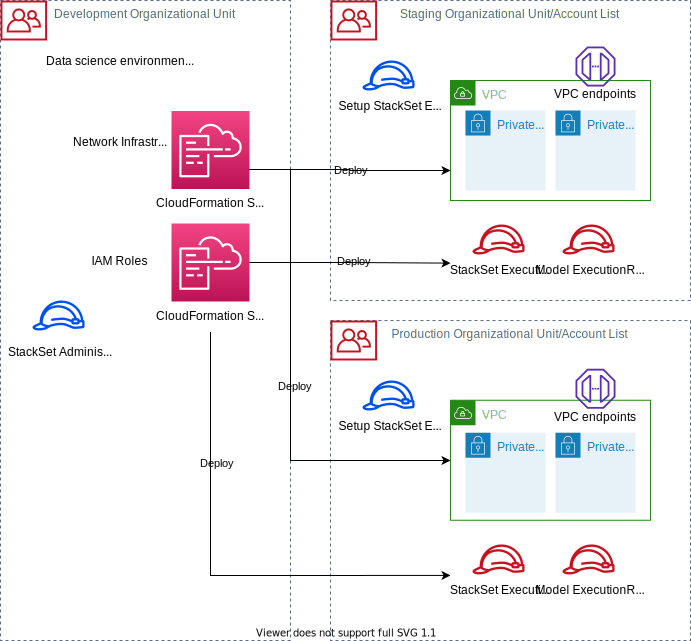

Two stack sets - one for the VPC infrastructure and another for the roles - are deployed for each environment type, staging and production. <br/>
One-off setup is needed to enable **multi-account** model deployment workflow with SageMaker MLOps projects. You **don't need** to perform this setup if you are going to use single-account deployment only.

### Step 1
The provisioning of a data science environment uses CloudFormation stack set to deploy the IAM roles and VPC infrastructure into the target accounts.
The solution uses `SELF_MANAGED` stack set permission model and needs two IAM roles:
- `AdministratorRole` in the development account (main account)
- `SetupStackSetExecutionRole` in each of the target accounts

You must provision these roles **before** starting the solution deployment. The `AdministratorRole` is automatically created during the solution deployment. For the `SetupStackSetExecutionRole` you can use the delivered CloudFormation template [`env-iam-setup-stacksest-role.yaml`](cfn_templates/env-iam-setup-stacksest-role.yaml) or your own process of provisioning of an IAM role.

```bash
# STEP 1:
# SELF_MANAGED stack set permission model:
# Deploy a stack set execution role to _EACH_ of the target accounts in both staging and prod OUs
# This stack set execution role is used to deploy the target accounts stack sets in env-main.yaml
# !!!!!!!!!!!! RUN THIS COMMAND IN EACH OF THE TARGET ACCOUNTS !!!!!!!!!!!!
ENV_NAME="sm-mlops"
ENV_TYPE=# use your own consistent environment stage names like "staging" and "prod"
STACK_NAME=$ENV_NAME-setup-stackset-role
ADMIN_ACCOUNT_ID=<DATA SCIENCE DEVELOPMENT ACCOUNT ID>
SETUP_STACKSET_ROLE_NAME=$ENV_NAME-setup-stackset-execution-role

# Delete stack if it exists
aws cloudformation delete-stack --stack-name $STACK_NAME

aws cloudformation deploy \
                --template-file cfn_templates/env-iam-setup-stackset-role.yaml \
                --stack-name $STACK_NAME \
                --capabilities CAPABILITY_NAMED_IAM \
                --parameter-overrides \
                EnvName=$ENV_NAME \
                EnvType=$ENV_TYPE \
                StackSetExecutionRoleName=$SETUP_STACKSET_ROLE_NAME \
                AdministratorAccountId=$ADMIN_ACCOUNT_ID

aws cloudformation describe-stacks \
    --stack-name $STACK_NAME \
    --output table \
    --query "Stacks[0].Outputs[*].[OutputKey, OutputValue]"
```

The name of the provisioned IAM role `StackSetExecutionRoleName` must be passed to the `env-main.yaml` template or used in Service Catalog-based deployment as `SetupStackSetExecutionRoleName` parameter.

### Step 2
**This step is only needed if you use AWS Organizations setup.**<br/>
A delegated administrator account must be registered in order to enable `ListAccountsForParent` AWS Organization API call. If the data science account is already the management account in the AWS Organizations, this step must be skipped.

```bash
# STEP 2:
# Register a delegated administrator to enable AWS Organizations API permission for non-management account
# Must be run under administrator in the AWS Organizations _management account_
aws organizations register-delegated-administrator \
    --service-principal=member.org.stacksets.cloudformation.amazonaws.com \
    --account-id=$ADMIN_ACCOUNT_ID

aws organizations list-delegated-administrators  \
    --service-principal=member.org.stacksets.cloudformation.amazonaws.com
```

## Multi-region deployment considerations
The solution is designed for multi-region deployment. You can deploy end-to-end stack in any region of a single AWS account. The following limitations and considerations apply:

+ The **shared IAM roles** (`DSAdministratorRole`, `SageMakerDetectiveControlExecutionRole`, `SCLaunchRole`) are created each time you deploy a new core infrastructure (`core-main`) or "quickstart" (`data-science-environment-quickstart`) stack. They created with `<StackName>-<RegionName>` prefix and designed to be unique within your end-to-end data science environment. For example, if you deploy one stack set (including core infrastructure and team data science environment) in one region and another stack in another region, these two stacks will not share any IAM roles and any users assuming any persona roles will have an independent set of permissions per stack set.
+ The **environment IAM roles** (`DSTeamAdministratorRole`, `DataScientistRole`, `SageMakerExecutionRole`, `SageMakerPipelineExecutionRole`, `SCProjectLaunchRole`, `SageMakerModelExecutionRole`) are created with unique names. Each deployment of a new data science environment (via CloudFormation or via AWS Service Catalog) creates a set of unique roles.
+ SageMaker Studio uses two pre-defined roles `AmazonSageMakerServiceCatalogProductsLaunchRole` and `AmazonSageMakerServiceCatalogProductsUseRole`. These roles are global for the AWS account and created by the first deployment of core infrastructure. These two roles have `Retain` deletion policy and _are not deleted_ when you delete the stack which has created these roles.

## Clean up
You must clean up provisioned resources to avoid charges in your AWS account.
The solution provides a [clean-up notebook](sm-notebooks/99-clean-up.ipynb) with a full clean-up script. You can run this script after you have finished experimenting with your data science environment. This is the recommended way of doing clean up.  
Alternatively, you can also follow the CLI-based clean up instructions below.

### Step 1: Clean up MLOps projects
If you created any SageMaker projects, you must clean up resources as described in the [Clean up after working with MLOps project templates](#clean-up-after-working-with-mlops-project-templates) section.

To delete resources of the multiple projects, you can use this [shell script](test/cfn-test-e2e.sh).

### Step 2: Empty data and model S3 buckets
CloudFormation `delete-stack` will not remove any non-empty S3 bucket. You must empty data science environment S3 buckets for data and models before you can delete the data science environment stack.

First, remove VPC-only access policy from the data and model bucket to be able to delete objects from a CLI terminal.
```sh
ENV_NAME=<use default name `sm-mlops` or your data science environment name you chosen when you created the stack>
aws s3api delete-bucket-policy --bucket $ENV_NAME-dev-${AWS_DEFAULT_REGION}-data
aws s3api delete-bucket-policy --bucket $ENV_NAME-dev-${AWS_DEFAULT_REGION}-models
```

❗ **This is a destructive action. The following command will delete all files in the data and models S3 buckets** ❗  

Now you can empty the buckets:
```sh
aws s3 rm s3://$ENV_NAME-dev-$AWS_DEFAULT_REGION-data --recursive
aws s3 rm s3://$ENV_NAME-dev-$AWS_DEFAULT_REGION-models --recursive
```

### Step 3: Delete data science environment CloudFormation stacks
Depending on the [deployment type](#deployment-options), you must delete the corresponding CloudFormation stacks. The following commands use the default stack names. If you customized the stack names, adjust the commands correspondingly.

#### Delete data science environment quickstart
```sh
aws cloudformation delete-stack --stack-name ds-quickstart
aws cloudformation wait stack-delete-complete --stack-name ds-quickstart
aws cloudformation delete-stack --stack-name sagemaker-mlops-package-cfn
```

#### Delete two-step deployment via CloudFormation
```sh
aws cloudformation delete-stack --stack-name sm-mlops-env
aws cloudformation wait stack-delete-complete --stack-name sm-mlops-env
aws cloudformation delete-stack --stack-name sm-mlops-core 
aws cloudformation wait stack-delete-complete --stack-name sm-mlops-core
aws cloudformation delete-stack --stack-name sagemaker-mlops-package-cfn
```

#### Delete two-step deployment via CloudFormation and AWS Service Catalog
1. Assume DS Administrator IAM role via link in the CloudFormation output.
```sh
aws cloudformation describe-stacks \
    --stack-name sm-mlops-core  \
    --output table \
    --query "Stacks[0].Outputs[*].[OutputKey, OutputValue]"
```

2. In AWS Service Catalog console go to the [_Provisioned Products_](https://console.aws.amazon.com/servicecatalog/home?#provisioned-products), select your product and click **Terminate** from the **Action** button. Wait until the delete process ends.


3. Delete the core infrastructure CloudFormation stack:
```sh
aws cloudformation delete-stack --stack-name sm-mlops-core
aws cloudformation wait stack-delete-complete --stack-name sm-mlops-core
aws cloudformation delete-stack --stack-name sagemaker-mlops-package-cfn
```

### Step 4: Delete EFS
The deployment of Studio creates a new EFS in your account. This EFS is shared with all users of Studio and contains home directories for Studio users and may contain your data. When you delete the data science environment stack, the Studio domain, user profile and Apps are also deleted. However, the EFS **will not be deleted** and kept "as is" in your account. Additional resources are created by Studio and retained upon deletion together with the EFS:
- EFS mounting points in each private subnet of your VPC
- ENI for each mounting point
- Security groups for EFS inbound and outbound traffic

❗ To delete the EFS and EFS-related resources in your AWS account created by the deployment of this solution, do the following steps **after** running `delete-stack` commands.

❗ **This is a destructive action. All data on the EFS will be deleted (SageMaker home directories). You may want to backup the EFS before deletion.** ❗ 
  
From AWS console:
aGot to the [EFS console](https://console.aws.amazon.com/efs/home?#/file-systems) and delete the SageMaker EFS. You may want to backup the EFS before deletion.

  To find the SageMaker EFS, click on the file system ID and then on the Tags tab. You see a tag with the Tag Key ManagedByAmazonSageMakerResource. Its Tag Value contains the SageMaker domain ID:
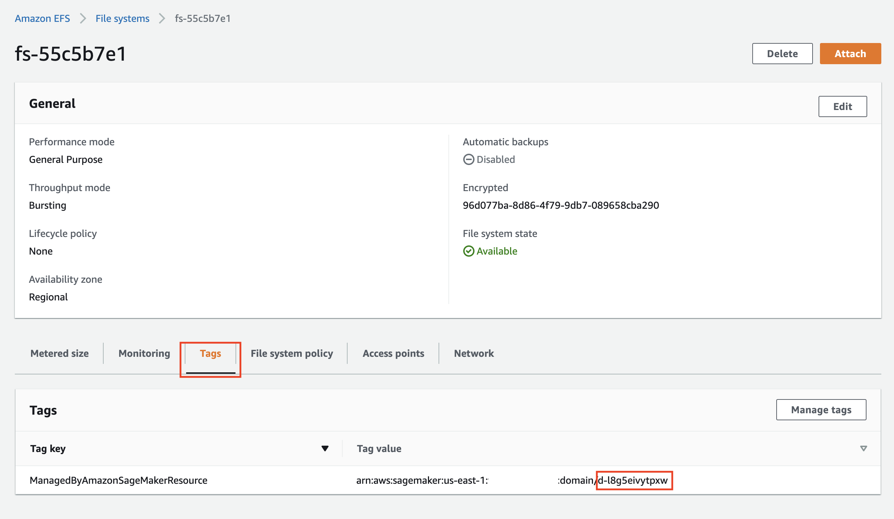

  Click on the Delete button to delete this EFS.

- Go to the [VPC console](https://console.aws.amazon.com/vpc/home?#vpcs) and delete the data science VPC

Alternatively, you can remove EFS using the following AWS CLI commands:

1. List SageMaker domain IDs for all EFS with SageMaker tag:
```sh
aws efs describe-file-systems \
  --query 'FileSystems[].Tags[?Key==`ManagedByAmazonSageMakerResource`].Value[]'
```

❗ If you have multiple EFS, double check that you copy the correct domain ID ❗ 

2. Copy the SageMaker domain ID and run the following script from the solution directory:  

❗ This script will delete the EFS ❗ 
```sh
SM_DOMAIN_ID=#SageMaker domain id
pipenv run python3 functions/pipeline/clean-up-efs-cli.py $SM_DOMAIN_ID
```

For the full clean-up scrip please refer to the `Clean up` section in the delivered [shell script](test/cfn-test-e2e.sh) and instructions in [MLOps project section](#clean-up-after-MLOps-project-templates).

## Deployment types
The following three sections describes each deployment type and deployment use case in detail.

### Data science environment quickstart
This option deploys the end-to-end infrastructure and a Data Science Environment in one go.
You can change only few deployment options. The majority of the options are set to their default values.
  
📜 Use this option if you want to provision a _completely new set_ of the infrastructure and do not want to parametrize the deployment.

❗ With Quickstart deployment type you can uses single-account model deployment only. Do not select `YES` for `MultiAccountDeployment` parameter for model deploy SageMaker project template:


The only deployment options you can change are:
+ `CreateSharedServices`: default `NO`. Set to `YES` if you want to provision a shared services VPC with a private PyPI mirror (_not implemented at this stage_)
+ `VPCIDR`: default `10.0.0.0/16`. CIDR block for the new VPC
+ Private and public subnets CIDR blocks: default `10.0.0.0/19`

Make sure you specify the CIDR blocks which do not conflict with your existing network IP ranges.

❗ You cannot use existing VPC or existing IAM roles to deploy this stack. The stack will provision a new own set of network and IAM resources.

Initiate the stack deployment with the following command. Use the S3 bucket name you used to upload CloudFormation templates in **Package CloudFormation templates** section.

```bash
STACK_NAME="ds-quickstart"
ENV_NAME="sagemaker-mlops"

aws cloudformation create-stack \
    --template-url https://s3.$AWS_DEFAULT_REGION.amazonaws.com/$S3_BUCKET_NAME/sagemaker-mlops/data-science-environment-quickstart.yaml \
    --region $AWS_DEFAULT_REGION \
    --stack-name $STACK_NAME \
    --disable-rollback \
    --capabilities CAPABILITY_NAMED_IAM \
    --parameters \
        ParameterKey=EnvName,ParameterValue=$ENV_NAME \
        ParameterKey=EnvType,ParameterValue=dev \
        ParameterKey=SeedCodeS3BucketName,ParameterValue=$S3_BUCKET_NAME
```

The full end-to-end deployment takes about 25 minutes.

### Data science quickstart clean up
Refer to [clean up](#clean-up) section.

### Two-step deployment via CloudFormation
Using this option you provision a Data Science environment in two steps, each with its own CloudFormation template. You can control all deployment parameters.  

📜 Use this option if you want to parametrize every aspect of the deployment based on your specific requirements and environment.

❗ You can select your existing VPC and network resources (subnets, NAT gateways, route tables) and existing IAM resources to be used for stack set deployment. Set the correspoinding CloudFormation parameters to names and ARNs or your existing resources.

❗ You must specify the valid OU IDs for the `OrganizationalUnitStagingId`/`OrganizationalUnitProdId` **or** `StagingAccountList`/`ProductionAccountList` parameters for the `env-main.yaml` template to enable multi-account model deployment.

You can use the provided [shell script](test/cfn-test-e2e.sh) to run this deployment type or follow the commands below.

#### Step 1: Deploy the core infrastructure
In this step you deploy the _shared core infrastructure_ into your AWS Account. The stack (`core-main.yaml`) will provision:
1. Shared IAM roles for Data Science personas and services (optional if you bring your own IAM roles)
2. A shared services VPC and related networking resources (optional if you bring your own network configuration)
3. An ECS Fargate cluster to run a private PyPi mirror (_not implemented at this stage_)
4. An AWS Service Catalog portfolio to provide a self-service deployment for the **Data Science administrator** user role
5. Security guardrails for your Data Science environment (_detective controls are not implemented at this stage_)

The deployment options you can use are:
+ `CreateIAMRoles`: default `YES`. Set to `NO` if you have created the IAM roles outside of the stack (e.g. via a separate process) - such as "Bring Your Own IAM Role (BYOR IAM)" use case
+ `CreateSharedServices`: default `NO`. Set to `YES` if you would like to create a shared services VPC and an ECS Fargate cluster for a private PyPi mirror (_not implemented at this stage_)
+ `CreateSCPortfolio`: default `YES`. Set to `NO`if you don't want to to deploy an AWS Service Catalog portfolio with Data Science environment products
+ `DSAdministratorRoleArn`: **required** if `CreateIAMRoles=NO`, otherwise will be automatically provisioned
+ `SCLaunchRoleArn`: **required** if `CreateIAMRoles=NO`, otherwise will be automatically provisioned
+ `SecurityControlExecutionRoleArn`: **required** if `CreateIAMRoles=NO`, otherwise will be automatically provisioned

The following command uses the default values for the deployment options. You can specify parameters via `ParameterKey=<ParameterKey>,ParameterValue=<Value>` pairs in the `aws cloudformation create-stack` call:
```sh
STACK_NAME="sm-mlops-core"

aws cloudformation create-stack \
    --template-url https://s3.$AWS_DEFAULT_REGION.amazonaws.com/$S3_BUCKET_NAME/sagemaker-mlops/core-main.yaml \
    --region $AWS_DEFAULT_REGION \
    --stack-name $STACK_NAME  \
    --disable-rollback \
    --capabilities CAPABILITY_IAM CAPABILITY_NAMED_IAM \
    --parameters \
        ParameterKey=StackSetName,ParameterValue=$STACK_NAME
```

After a successful stack deployment, you can see the stack output:
```sh
aws cloudformation describe-stacks \
    --stack-name sm-mlops-core  \
    --output table \
    --query "Stacks[0].Outputs[*].[OutputKey, OutputValue]"
```

#### Step 2: Deploy a Data Science environment

The step 2 CloudFormation template (`env-main.yaml`) provides two deployment options:
+ **Deploy Studio into a new VPC**: This option provisions a new AWS network infrastructure consisting of:
   - VPC
   - private subnet in each AZ
   - optional public subnet in each AZ. The public subnets are provisioned only if you chose to create NAT gateways
   - VPC endpoints to access public AWS services and Amazon S3 buckets for data science projects
   - security groups
   - optional NAT gateway in each AZ  
   - if you select the NAT gateway option, an internet gateway will be created and attached to the VPC
   - routing tables and routes for private and public subnets

You specify the number of AZs and CIDR blocks for VPC and each of the subnets.  
After provisioning the network infrastructure, the solution deploys Studio into this VPC.  

+ **Deploy Studio into an existing VPC**: This option provisions Studio in your existing AWS network infrastructure. You have several options to choose between existing or create new network resources:
  - VPC: you must provide a valid existing VPC Id
  - Subnets: you can choose between:
    - providing existing subnet CIDR blocks (set `CreatePrivateSubnets` to `NO`) - in this case no new subnets are provisioned and NAT gateway option **is not available**. All SageMaker resources are deployed into your existing VPC and private subnets. You use your existing NAT (if available) to access internet from the private subnets
    - provisioning new private (set `CreatePrivateSubnets` to `YES`) and optional (only if the NAT gateway option is selected, `CreateNATGateways` = `YES`) public subnets. The deployment creates new subnets with specified CIDR blocks inside your existing VPC.

You must specify the number of AZs you would like to deploy the network resources into.  

❗ A new internet gateway will be created and attached to the VPC in "existing VPC" scenario if you select the NAT gateway option by setting `CreateNATGateways` to `YES`. The stack creation will fail if there is an internet gateway _already attached_ to the existing VPC and you select the NAT gateway option.

Example of the existing VPC infrastructure:

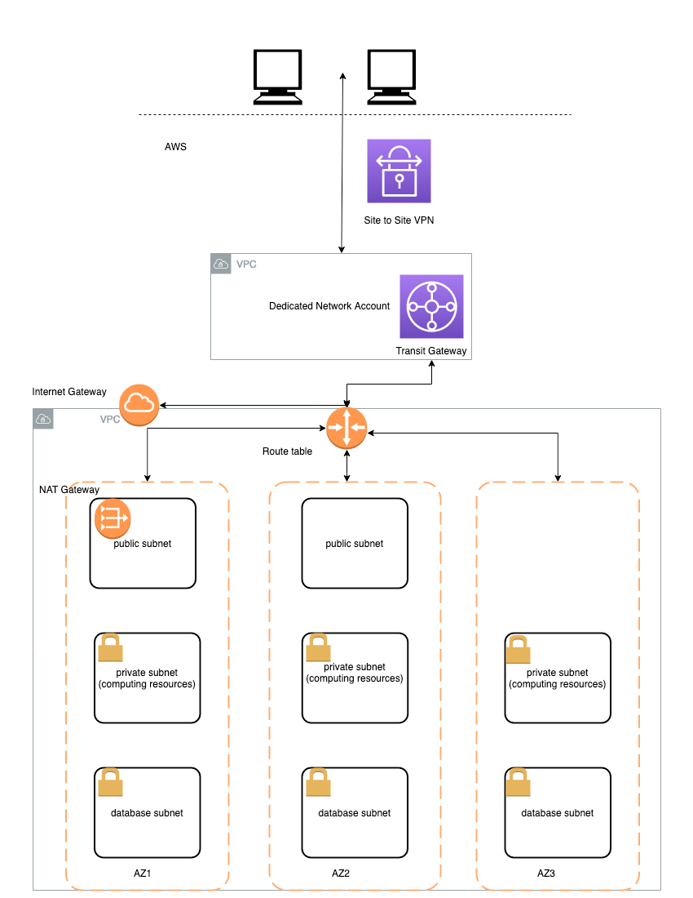

The Data Science environment deployment will provision the following resources in your AWS account:
+ environment-specific IAM roles (optional, if `CreateEnvironmentIAMRoles` set to `YES`)
+ a VPC with all network infrastructure for the environment (optional) - see the considerations above
+ VPC endpoints to access the environment's Amazon S3 buckets and AWS public services via private network
+ AWS KMS keys for data encryption 
+ two S3 buckets for environment data and model artifacts
+ AWS Service Catalog portfolio with environment-specific products
+ Studio domain and default user profile

If you choose the multi-account model deployment option by providing values for `OrganizationalUnitStagingId`/`OrganizationalUnitProdId` **or** `StagingAccountList`/`ProductionAccountList`, the deployment will provision the following resources in the target accounts:
+ VPC with a private subnet in each of the AZs, **no internet connectivity**
+ Security groups for SageMaker model hosting and VPC endpoints
+ Execution roles for stack set operations and SageMaker models

You can change any deployment options via CloudFormation parameters for [`core-main.yaml`](cfn_templates/core-main.yaml) and [`env-main.yaml`](cfn_templates/env-main.yaml) templates.

#### Single-account setup
Run command providing the deployment options for your environment. The following command uses the minimal set of the options:
```sh
STACK_NAME="sm-mlops-env"
ENV_NAME="sm-mlops"

aws cloudformation create-stack \
    --template-url https://s3.$AWS_DEFAULT_REGION.amazonaws.com/$S3_BUCKET_NAME/sagemaker-mlops/env-main.yaml \
    --region $AWS_DEFAULT_REGION \
    --stack-name $STACK_NAME \
    --disable-rollback \
    --capabilities CAPABILITY_NAMED_IAM \
    --parameters \
        ParameterKey=EnvName,ParameterValue=$ENV_NAME \
        ParameterKey=EnvType,ParameterValue=dev \
        ParameterKey=AvailabilityZones,ParameterValue=${AWS_DEFAULT_REGION}a\\,${AWS_DEFAULT_REGION}b \
        ParameterKey=NumberOfAZs,ParameterValue=2 \
        ParameterKey=SeedCodeS3BucketName,ParameterValue=$S3_BUCKET_NAME
```

#### Multi-account setup
If you would like to use **multi-account model deployment**, you must provide the valid values for OU IDs **or** account lists and the name for the `SetupStackSetExecutionRole`:
```sh 
STACK_NAME="sm-mlops-env"
ENV_NAME="sm-mlops"
STAGING_OU_ID=<OU id>
PROD_OU_ID=<OU id>
STAGING_ACCOUNTS=<comma-delimited account list>
PROD_ACCOUNTS=<comma-delimited account list>
SETUP_STACKSET_ROLE_NAME=$ENV_NAME-setup-stackset-execution-role

aws cloudformation create-stack \
    --template-url https://s3.$AWS_DEFAULT_REGION.amazonaws.com/$S3_BUCKET_NAME/sagemaker-mlops/env-main.yaml \
    --region $AWS_DEFAULT_REGION \
    --stack-name $STACK_NAME \
    --disable-rollback \
    --capabilities CAPABILITY_NAMED_IAM \
    --parameters \
        ParameterKey=EnvName,ParameterValue=$ENV_NAME \
        ParameterKey=EnvType,ParameterValue=dev \
        ParameterKey=AvailabilityZones,ParameterValue=${AWS_DEFAULT_REGION}a\\,${AWS_DEFAULT_REGION}b \
        ParameterKey=NumberOfAZs,ParameterValue=2 \
        ParameterKey=StartKernelGatewayApps,ParameterValue=NO \
        ParameterKey=SeedCodeS3BucketName,ParameterValue=$S3_BUCKET_NAME \
        ParameterKey=OrganizationalUnitStagingId,ParameterValue=$STAGING_OU_ID \
        ParameterKey=OrganizationalUnitProdId,ParameterValue=$PROD_OU_ID \
        ParameterKey=StagingAccountList,ParameterValue=$STAGING_ACCOUNTS \
        ParameterKey=ProductionAccountList,ParameterValue=$PROD_ACCOUNTS \
        ParameterKey=SetupStackSetExecutionRoleName,ParameterValue=$SETUP_STACKSET_ROLE_NAME
```

### CloudFormation clean up
Refer to [clean up](#clean-up) section.

### Two-step deployment via CloudFormation and AWS Service Catalog
This deployment option first deploys the core infrastructure including the AWS Service Catalog portfolio of Data Science products. In the second step, the Data Science Administrator deploys a Data Science environment via the AWS Service Catalog.  

📜 Use this option if you want to model the end user experience in provisioning a Data Science environment via AWS Service Catalog

❗ You can select your existing VPC and network resources (subnets, NAT gateways, route tables) and existing IAM resources to be used for stack set deployment. Set the corresponding CloudFormation and AWS Service Catalog product parameters to names and ARNs or your existing resources.

#### Step 1: Deploy the base infrastructure
Same as Step 1 from **Two-step deployment via CloudFormation**

#### Step 2: Deploy a Data Science environment via AWS Service Catalog
After the base infrastructure is provisioned, data scientists and other users must assume the DS Administrator IAM role (`AssumeDSAdministratorRole`) via link in the CloudFormation output. In this role, the users can browse the AWS Service Catalog and then provision a secure Studio environment.

First, print the output from the stack deployment in Step 1:
```bash
aws cloudformation describe-stacks \
    --stack-name sm-mlops-core  \
    --output table \
    --query "Stacks[0].Outputs[*].[OutputKey, OutputValue]"
```

Copy and paste the `AssumeDSAdministratorRole` link to a web browser and switch role to DS Administrator.

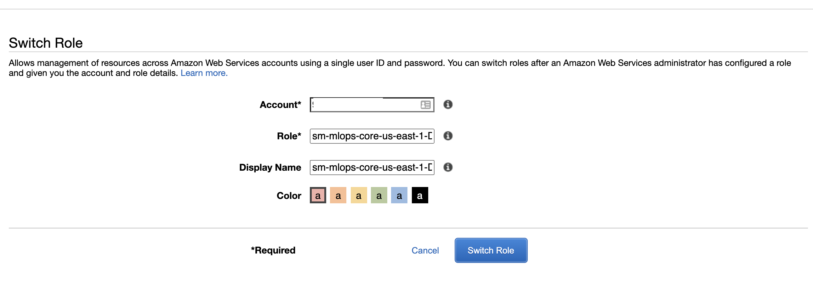

Go to AWS Service Catalog in the AWS console and select [**Products**](https://console.aws.amazon.com/servicecatalog/home?region=us-east-1#products) on the left pane:


You see the list of available products for your user role:


Click on the product name and and then on the **Launch product** on the product page:

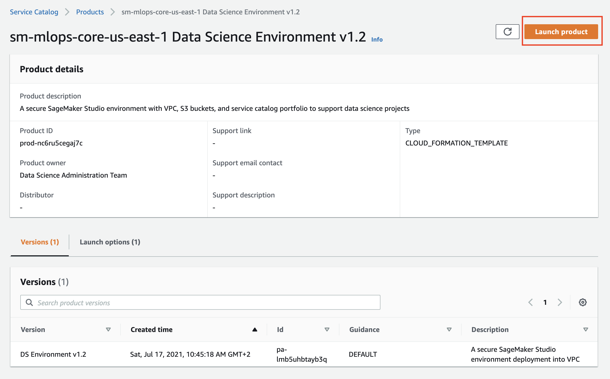

Fill the product parameters with values specific for your environment. Provide the valid values for OU ids **OR** for the staging and production account lists and the name for the `SetupStackSetExecutionRole` if you would like to enable multi-account model deployment, otherwise keep these parameters empty.

There are only two **required** parameters you must provide in the product launch console:  
- S3 bucket name with MLOps seed code - use the S3 bucket where you packaged the CloudFormation templates:

- Availability Zones: you need at least two availability zones for SageMaker model deployment workflow:
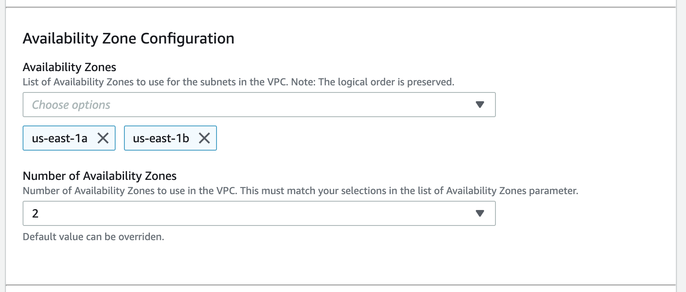

Wait until AWS Service Catalog finishes the provisioning of the Data Science environment stack and the product status becomes **Available**. The data science environment provisioning takes about 20 minutes to complete.

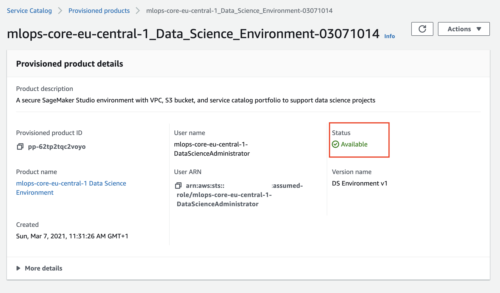

Now you provisioned the Data Science environment and can start working with it.

### Service Catalog clean up
Refer to [clean up](#clean-up) section.

## Post-deployment activities
After you successfully deploy all CloudFormation stacks and created the needed infrastructure, you can start Studio and start working with the delivered notebooks.

### Start Studio
To launch Studio you must go to [SageMaker console](https://console.aws.amazon.com/sagemaker/home?#/dashboard), click **Open SageMaker Studio** and click on the Open Studio link in the SageMaker Studio Control panel:


### Clone code repository
To use the provided notebooks you must clone the source code repository into your Studio environment.
Open a system terminal in Studio in the **Launcher** window:


Run the following command in the terminal:
```sh
git clone https://github.com/aws-samples/amazon-sagemaker-secure-mlops.git
```

The code repository will be downloaded and saved in your home directory in Studio.
Now go to the file browser and open [`00-setup` notebook](sm-notebooks/00-setup.ipynb):

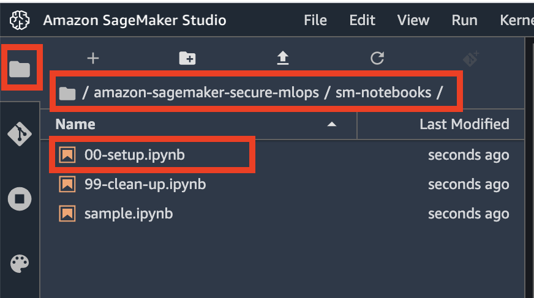

The first start of the notebook kernel on a new KernelGateway app takes about 5 minutes. Continue with further setup instructions in the notebook after Kernel is ready.

❗ You have to run the whole notebook to setup your SageMaker environment.

# Resources

- [R1]: [Amazon SageMaker Pipelines documentation](https://docs.aws.amazon.com/sagemaker/latest/dg/pipelines-sdk.html)
- [R2]: [Best practices for multi-account AWS environment](https://aws.amazon.com/organizations/getting-started/best-practices/)
- [R3]: [AWS Well-Architected Framework - Machine Learning Lens Whitepaper](https://d1.awsstatic.com/whitepapers/architecture/wellarchitected-Machine-Learning-Lens.pdf)  
- [R4]: [Terraform provider AWS GitHub](https://github.com/hashicorp/terraform-provider-aws)
- [R5]: [Data processing options for AI/ML](https://aws.amazon.com/blogs/machine-learning/data-processing-options-for-ai-ml/)
- [R6]: [Architect and build the full machine learning lifecycle with AWS: An end-to-end Amazon SageMaker demo](https://aws.amazon.com/blogs/machine-learning/architect-and-build-the-full-machine-learning-lifecycle-with-amazon-sagemaker/)
- [R7]: [End-to-end Amazon SageMaker demo](https://github.com/aws/amazon-sagemaker-examples/tree/master/end_to_end)
- [R8]: [Multi-account model deployment with Amazon SageMaker Pipelines](https://aws.amazon.com/blogs/machine-learning/multi-account-model-deployment-with-amazon-sagemaker-pipelines/)
- [R9]: [Building, automating, managing, and scaling ML workflows using Amazon SageMaker Pipelines](https://aws.amazon.com/blogs/machine-learning/building-automating-managing-and-scaling-ml-workflows-using-amazon-sagemaker-pipelines/)
- [R10]: [Best Practices for Organizational Units with AWS Organizations](https://aws.amazon.com/blogs/mt/best-practices-for-organizational-units-with-aws-organizations/)
- [R11]: [Build a CI/CD pipeline for deploying custom machine learning models using AWS services](https://aws.amazon.com/blogs/machine-learning/build-a-ci-cd-pipeline-for-deploying-custom-machine-learning-models-using-aws-services/)
- [R12]: [Configuring Amazon SageMaker Studio for teams and groups with complete resource isolation](https://aws.amazon.com/fr/blogs/machine-learning/configuring-amazon-sagemaker-studio-for-teams-and-groups-with-complete-resource-isolation/)
- [R13]: [Enable feature reuse across accounts and teams using Amazon SageMaker Feature Store](https://aws.amazon.com/blogs/machine-learning/enable-feature-reuse-across-accounts-and-teams-using-amazon-sagemaker-feature-store/)
- [R14]: [How Genworth built a serverless ML pipeline on AWS using Amazon SageMaker and AWS Glue](https://aws.amazon.com/blogs/machine-learning/how-genworth-built-a-serverless-ml-pipeline-on-aws-using-amazon-sagemaker-and-aws-glue/)
- [R15]: [SageMaker cross-account model](https://aws.amazon.com/premiumsupport/knowledge-center/sagemaker-cross-account-model/)
- [R16]: [Use Amazon CloudWatch custom metrics for real-time monitoring of Amazon Sagemaker model performance](https://aws.amazon.com/blogs/machine-learning/use-amazon-cloudwatch-custom-metrics-for-real-time-monitoring-of-amazon-sagemaker-model-performance/)
- [R17]: [Automate feature engineering pipelines with Amazon SageMaker](https://aws.amazon.com/blogs/machine-learning/automate-feature-engineering-pipelines-with-amazon-sagemaker/)
- [R18]: [Build a Secure Enterprise Machine Learning Platform on AWS](https://docs.aws.amazon.com/whitepapers/latest/build-secure-enterprise-ml-platform/build-secure-enterprise-ml-platform.html)
- [R19]: [Automate Amazon SageMaker Studio setup using AWS CDK](https://aws.amazon.com/blogs/machine-learning/automate-amazon-sagemaker-studio-setup-using-aws-cdk/)
- [R20]: [How to use trust policies with IAM roles](https://aws.amazon.com/blogs/security/how-to-use-trust-policies-with-iam-roles/)
- [R21]: [Use Amazon SageMaker Studio Notebooks](https://docs.aws.amazon.com/sagemaker/latest/dg/notebooks.html)
- [R22]: [Shutting Down Amazon SageMaker Studio Apps on a Scheduled Basis](https://medium.com/swlh/shutting-down-amazon-sagemaker-studio-kernelgateways-automatically-with-aws-lambda-41e93afef06b)
- [R23]: [Register and Deploy Models with Model Registry](https://docs.aws.amazon.com/sagemaker/latest/dg/model-registry.html)
- [R24]: [Setting up secure, well-governed machine learning environments on AWS](https://aws.amazon.com/blogs/mt/setting-up-machine-learning-environments-aws/)
- [R25]: [Machine Learning Best Practices in Financial Services: Blog post](https://aws.amazon.com/blogs/machine-learning/machine-learning-best-practices-in-financial-services/)
- [R26]: [Machine Learning Best Practices in Financial Services: Whitepaper](https://d1.awsstatic.com/whitepapers/machine-learning-in-financial-services-on-aws.pdf)
- [R27]: [Dynamic A/B testing for machine learning models with Amazon SageMaker MLOps projects](https://aws.amazon.com/blogs/machine-learning/dynamic-a-b-testing-for-machine-learning-models-with-amazon-sagemaker-mlops-projects/)
- [R28]: [Hosting a private PyPI server for Amazon SageMaker Studio notebooks in a VPC](https://aws.amazon.com/blogs/machine-learning/hosting-a-private-pypi-server-for-amazon-sagemaker-studio-notebooks-in-a-vpc/)
- [R29]: [Automate a centralized deployment of Amazon SageMaker Studio with AWS Service Catalog](https://aws.amazon.com/blogs/machine-learning/automate-a-centralized-deployment-of-amazon-sagemaker-studio-with-aws-service-catalog/)
- [R30]: [Orchestrate XGBoost ML Pipelines with Amazon Managed Workflows for Apache Airflow](https://aws.amazon.com/blogs/machine-learning/orchestrate-xgboost-ml-pipelines-with-amazon-managed-workflows-for-apache-airflow/)
- [R31]: [Amazon SageMaker Identity-Based Policy Examples](https://docs.aws.amazon.com/sagemaker/latest/dg/security_iam_id-based-policy-examples.html)
- [R32]: [Connect to SageMaker Through a VPC Interface Endpoint](https://docs.aws.amazon.com/sagemaker/latest/dg/interface-vpc-endpoint.html)
- [R33]: [Extend Amazon SageMaker Pipelines to include custom steps using callback steps](https://aws.amazon.com/blogs/machine-learning/extend-amazon-sagemaker-pipelines-to-include-custom-steps-using-callback-steps/)
- [R34]: [Create Amazon SageMaker projects using third-party source control and Jenkins](https://aws.amazon.com/blogs/machine-learning/create-amazon-sagemaker-projects-using-third-party-source-control-and-jenkins/)
- [R35]: [Define and run Machine Learning pipelines on Step Functions using Python, Workflow Studio, or States Language](https://aws.amazon.com/blogs/machine-learning/define-and-run-machine-learning-pipelines-on-step-functions-using-python-workflow-studio-or-states-language/)
- [R36]: [Dive deep into Amazon SageMaker Studio Notebooks architecture](https://aws.amazon.com/blogs/machine-learning/dive-deep-into-amazon-sagemaker-studio-notebook-architecture/)
- [R37]: [Model and data lineage in machine learning experimentation](https://aws.amazon.com/blogs/machine-learning/model-and-data-lineage-in-machine-learning-experimentation/)
- [R38]: [Customize Amazon SageMaker Studio using Lifecycle Configurations](https://aws.amazon.com/blogs/machine-learning/customize-amazon-sagemaker-studio-using-lifecycle-configurations/)
- [R39]: [Patterns for multi-account, hub-and-spoke Amazon SageMaker model registry](https://aws.amazon.com/blogs/machine-learning/patterns-for-multi-account-hub-and-spoke-amazon-sagemaker-model-registry/)
- [R40]: [Managing your machine learning lifecycle with MLflow and Amazon SageMaker](https://aws.amazon.com/blogs/machine-learning/managing-your-machine-learning-lifecycle-with-mlflow-and-amazon-sagemaker/)
- [R41]: [Scheduling Jupyter notebooks on SageMaker ephemeral instances](https://aws.amazon.com/blogs/machine-learning/scheduling-jupyter-notebooks-on-sagemaker-ephemeral-instances/)
- [R42]: [Building machine learning workflows with Amazon SageMaker Processing jobs and AWS Step Functions](https://aws.amazon.com/blogs/machine-learning/building-machine-learning-workflows-with-amazon-sagemaker-processing-jobs-and-aws-step-functions/) 
- [R43]: [How Slalom and WordStream Used MLOps to Unify Machine Learning and DevOps on AWS](https://aws.amazon.com/blogs/apn/how-slalom-and-wordstream-used-mlops-to-unify-machine-learning-and-devops-on-aws/)
- [R44]: [Create a cross-account machine learning training and deployment environment with AWS Code Pipeline](https://aws.amazon.com/blogs/machine-learning/create-a-cross-account-machine-learning-training-and-deployment-environment-with-aws-code-pipeline/)


## AWS Solutions
- [SOL1]: [AWS MLOps Framework](https://aws.amazon.com/solutions/implementations/aws-mlops-framework/)
- [SOL2]: [Amazon SageMaker with Guardrails on AWS](https://aws.amazon.com/quickstart/architecture/amazon-sagemaker-with-guardrails/)

## Secure ML environments
- [S1]: [Building secure machine learning environments with Amazon SageMaker](https://aws.amazon.com/blogs/machine-learning/building-secure-machine-learning-environments-with-amazon-sagemaker/)
- [S2]: [Secure Data Science Reference Architecture GitHub](https://github.com/aws-samples/secure-data-science-reference-architecture)
- [S3]: [SageMaker Notebook instance lifecycle config samples GitHub](https://github.com/aws-samples/amazon-sagemaker-notebook-instance-lifecycle-config-samples)
- [S4]: [Securing Amazon SageMaker Studio connectivity using a private VPC](https://aws.amazon.com/blogs/machine-learning/securing-amazon-sagemaker-studio-connectivity-using-a-private-vpc/)
- [S5]: [Secure deployment of Amazon SageMaker resources](https://aws.amazon.com/blogs/security/secure-deployment-of-amazon-sagemaker-resources/)
- [S6]: [Understanding Amazon SageMaker notebook instance networking configurations and advanced routing options](https://aws.amazon.com/blogs/machine-learning/understanding-amazon-sagemaker-notebook-instance-networking-configurations-and-advanced-routing-options/)
- [S7]: [Security group rules for different use cases](https://docs.aws.amazon.com/AWSEC2/latest/UserGuide/security-group-rules-reference.html)
- [S8]: [Data encryption at rest in SageMaker Studio](https://docs.aws.amazon.com/sagemaker/latest/dg/encryption-at-rest-studio.html)
- [S9]: [Connect SageMaker Studio Notebooks to Resources in a VPC](https://docs.aws.amazon.com/sagemaker/latest/dg/studio-notebooks-and-internet-access.html)
- [S10]: [Control root access to Amazon SageMaker notebook instances](https://aws.amazon.com/blogs/machine-learning/control-root-access-to-amazon-sagemaker-notebook-instances/)  
- [S11]: [7 ways to improve security of your machine learning workflows](https://aws.amazon.com/blogs/security/7-ways-to-improve-security-of-your-machine-learning-workflows/)
- [S12]: [PySparkProcessor - Unable to locate credentials for boto3 call in AppMaster](https://github.com/aws/amazon-sagemaker-examples/issues/1689)
- [S13]: [Private package installation in Amazon SageMaker running in internet-free mode](https://aws.amazon.com/blogs/machine-learning/private-package-installation-in-amazon-sagemaker-running-in-internet-free-mode/)
- [S14]: [Securing Amazon SageMaker Studio internet traffic using AWS Network Firewall](https://aws.amazon.com/blogs/machine-learning/securing-amazon-sagemaker-studio-internet-traffic-using-aws-network-firewall/)
- [S15]: [Secure Your SageMaker Studio Access Using AWS PrivateLink and AWS IAM SourceIP Restrictions](https://aws.amazon.com/about-aws/whats-new/2020/12/secure-sagemaker-studio-access-using-aws-privatelink-aws-iam-sourceip-restrictions/)
- [S16]: [Model Risk Management by Deloitte](https://www2.deloitte.com/content/dam/Deloitte/fr/Documents/risk/deloitte_model-risk-management_plaquette.pdf)
- [S17]: [Building secure Amazon SageMaker access URLs with AWS Service Catalog](https://aws.amazon.com/blogs/mt/building-secure-amazon-sagemaker-access-urls-with-aws-service-catalog/)
- [S18]: [Secure multi-account model deployment with Amazon SageMaker Series](https://aws.amazon.com/blogs/machine-learning/part-1-secure-multi-account-model-deployment-with-amazon-sagemaker/)
- [S19]: [Launch Amazon SageMaker Studio from external applications using presigned URLs](https://aws.amazon.com/blogs/machine-learning/launch-amazon-sagemaker-studio-from-external-applications-using-presigned-urls/)

## Workshops
- [W1]: [SageMaker immersion day GitHub](https://github.com/aws-samples/amazon-sagemaker-immersion-day)  
- [W2]: [SageMaker immersion day workshop 2.0](https://sagemaker-immersionday.workshop.aws/)  
- [W3]: [Amazon Sagemaker MLOps workshop GitHub](https://github.com/awslabs/amazon-sagemaker-mlops-workshop)
- [W4]: [Operationalizing the ML pipeline workshop](https://operational-machine-learning-pipeline.workshop.aws/)
- [W5]: [Safe MLOps deployment pipeline](https://mlops-safe-deployment-pipeline.workshop.aws/)
- [W6]: [Building secure environments workshop](https://sagemaker-workshop.com/security_for_sysops.html)
- [W7]: [Amazon Managed Workflows for Apache Airflow workshop](https://amazon-mwaa-for-analytics.workshop.aws/en/)
- [W8]: [Secure Data Science with Amazon SageMaker Studio Workshop](https://catalog.us-east-1.prod.workshops.aws/v2/workshops/c882cd42-8ec8-4112-9469-9fab33471e85/en-US)
- [W9]: [MLOps and Integrations](https://mlops-and-integrations.workshop.aws/)
- [W10]: [Serverless ML pipeline](https://github.com/dylan-tong-aws/aws-serverless-ml-pipeline)
- [W11]: [Basic SageMaker MLOps](https://github.com/aws-samples/mlops-amazon-sagemaker-devops-with-ml)
- [W12]: [Data Science on AWS (ML end-to-end pipeline)](https://github.com/data-science-on-aws/workshop)

## MLOps and ML production related resources
- https://github.com/visenger/awesome-mlops
- https://github.com/EthicalML/awesome-production-machine-learning
- https://github.com/alirezadir/Production-Level-Deep-Learning
- https://www.featurestore.org/
- https://twitter.com/chipro/status/1318190833141714949?s=20
- [Introducing TWIML’s New ML and AI Solutions Guide](https://twimlai.com/solutions/introducing-twiml-ml-ai-solutions-guide/)
- [TWIML podcast: Feature Stores for MLOps with Mike del Balso](https://twimlai.com/feature-stores-for-mlops-with-mike-del-balso/)
- [TWIML podcast: Enterprise Readiness, MLOps and Lifecycle Management with - - Jordan Edwards](https://twimlai.com/twiml-talk-321-enterprise-readiness-mlops-and-lifecycle-management-with-jordan-edwards/)
- [Full stack deep learning free online course](https://course.fullstackdeeplearning.com/)
- [Continuous Delivery for Machine Learning](https://martinfowler.com/articles/cd4ml.html)
- [Feature Store vs Data Warehouse](https://medium.com/data-for-ai/feature-store-vs-data-warehouse-306d1567c100)
- [Seldon Core](https://docs.seldon.io/projects/seldon-core/en/latest/)
- [MLflow and PyTorch — Where Cutting Edge AI meets MLOps](https://medium.com/pytorch/mlflow-and-pytorch-where-cutting-edge-ai-meets-mlops-1985cf8aa789)
- [5 Lessons Learned Building an Open Source MLOps Platform](https://towardsdatascience.com/5-lessons-learned-building-an-open-source-mlops-platform-624574a44c09)

## Appendix A
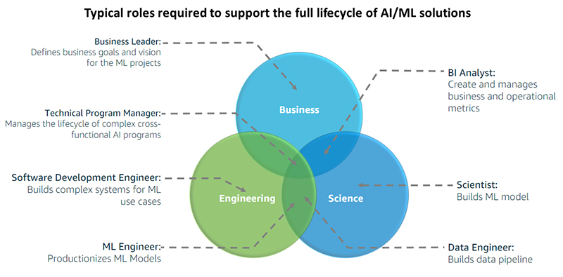

Source: [Increase your machine learning success with AWS ML services and AWS Machine Learning Embark](https://aws.amazon.com/blogs/machine-learning/increase-your-machine-learning-success-with-aws-ml-services-and-aws-ml-embark/)

## Appendix B
[Deployment into an existing VPC and with pre-provisioned IAM resources](base-vpc-deployment.md)

# Appendix C

## Solution CI/CD pipelines
The solution is tested end-to-end for all possible depoyment options using [AWS CodePipeline](https://aws.amazon.com/codepipeline/) and AWS developer tools.

## Setup CI/CD pipelines
### Create CodePipeline artifact Amazon S3 buckets
The CodePipeline pipelines used in the solution deploy stack in different regions. You must create an Amazon S3 CodePipeline bucket per region following the naming convention: `codepipeline-<ProjectName>-<AWS Region>`:

```
PROJECT_NAME=sm-mlops
aws s3 mb s3://codepipeline-${PROJECT_NAME}-us-east-2 --region us-east-2
aws s3 mb s3://codepipeline-${PROJECT_NAME}-eu-central-1 --region eu-central-1
aws s3 mb s3://codepipeline-${PROJECT_NAME}-eu-west-1 --region eu-west-1
aws s3 mb s3://codepipeline-${PROJECT_NAME}-eu-west-2 --region eu-west-2
```

### Setup CodeCommit repository and notifications
To use CI/CD pipelines you must setup CodeCommit repository and configure notifications on pipeline status changes.

+ Setup CodeCommit repository

+ Create SNS topic to receive notifications

### Setup pipelines
To setup all CI/CD pipelines run the following command from the solution directory:
```bash
aws cloudformation deploy \
    --template-file test/cfn_templates/create-base-infra-pipeline.yaml \
    --stack-name base-infra-$AWS_DEFAULT_REGION \
    --capabilities CAPABILITY_IAM CAPABILITY_NAMED_IAM \
    --parameter-overrides \
    CodeCommitRepositoryArn= \
    NotificationArn=
```

# Appendix D

## Terraform considerations

[AWS Service Catalog Terraform Reference Architecture GitHub](https://github.com/aws-samples/aws-service-catalog-terraform-reference-architecture)

[AWS Service Catalog FAQ](https://aws.amazon.com/servicecatalog/faqs/):
> Q: Can I use Terraform with AWS Service Catalog?  

> You can leverage the [AWS Service Catalog Terraform Reference Architecture](https://d1.awsstatic.com/whitepapers/DevOps/TerraformReferenceArchitecture-instructions.pdf). This reference architecture provides an example for using AWS Service Catalog products, an AWS CloudFormation custom resource, and Terraform to provision resources on AWS.

# Appendix E

How to get an IAM snapshot from the account:
```
aws iam get-account-authorization-details > iam_snapshot.json
```

## Enabling SageMaker projects programmatically
To enable SageMaker projects you need first to enable SageMaker AWS Service Catalog portfolio and then to associate the Studio execution role with the portfolio using https://docs.aws.amazon.com/cli/latest/reference/servicecatalog/associate-principal-with-portfolio.html.

In addition you need to make sure to create two roles (which otherwise get created through the console): `AmazonSageMakerServiceCatalogProductsUseRole` and `AmazonSageMakerServiceCatalogProductsLaunchRole`.

Below a sample code_snippet for boto3 for the full workflow:
  + `studio_role_arn` is the role which is associated with Studio
  + `sc_client` is AWS Service Catalog boto3 client
  + `client`: is SageMaker boto3 client

```python
def enable_projects(studio_role_arn):
    # enable Project on account level (accepts portfolio share)
    response = client.enable_sagemaker_servicecatalog_portfolio()

    # associate studio role with portfolio
    response = sc_client.list_accepted_portfolio_shares()

    portfolio_id = ''
    for portfolio in response['PortfolioDetails']:
        if portfolio['ProviderName'] == 'Amazon SageMaker':
            portfolio_id = portfolio['Id']

    response = sc_client.associate_principal_with_portfolio(
        PortfolioId=portfolio_id,
        PrincipalARN=studio_role_arn,
        PrincipalType='IAM'
    )
```

# Appendix F

# Alternative architectural options for MLOps
The following architectural options for implementing MLOps pipeline are available:

+ SageMaker Projects + CodePipeline (implemented by this solutions)
+ [Step Functions](https://aws-step-functions-data-science-sdk.readthedocs.io/en/latest/readmelink.html#getting-started-with-sample-jupyter-notebooks)
+ [Apache AirFlow](https://airflow.apache.org/), [SageMaker Operators for AirFlow](https://sagemaker.readthedocs.io/en/stable/using_workflow.html)
+ [SageMaker Operators for Kubernetes](https://aws.amazon.com/blogs/machine-learning/introducing-amazon-sagemaker-operators-for-kubernetes/)


# Appendix G

# Develop and deploy seed code
You can develop and evolve the seed code for your own needs. To deliver the new version of the seed code **in form of the project template**, please follow the steps:
+ Update existing or create your own version of the seed code
+ Zip all files that should go into a project CodeCommit repository into a single `.zip` file
+ Upload this `.zip` file to an Amazon S3 bucket of your choice. You must specify this S3 bucket name when you create a new project in Studio
+ Set a special tag `servicecatalog:provisioning` on the uploaded file. This tag will enable access to the object by `AmazonSageMakerServiceCatalogProductsLaunchRole` IAM role: 
  ```bash
  aws s3api put-object-tagging \
          --bucket <your Amazon S3 bucket name> \
          --key <your project name>/seed-code/<zip-file name> \
          --tagging 'TagSet=[{Key=servicecatalog:provisioning,Value=true}]'
  ```
+ Update the `AWS::CodeCommit::Repository` resource in the CloudFormation template with the CI/CD pipeline for the corresponding MLOps project ([`project-model-build-train.yaml`](https://github.com/aws-samples/amazon-sagemaker-secure-mlops/blob/master/cfn_templates/project-model-build-train.yaml) or [`project-model-deploy.yaml`](https://github.com/aws-samples/amazon-sagemaker-secure-mlops/blob/master/cfn_templates/project-model-deploy.yaml)) with the new zip-file name.
  
  Model deploy project `project-model-deploy.yaml`:
  ```yaml
    ModelDeployCodeCommitRepository:
      Type: AWS::CodeCommit::Repository
      Properties:
        # Max allowed length: 100 chars
        RepositoryName: !Sub sagemaker-${SageMakerProjectName}-${SageMakerProjectId}-model-deploy # max: 10+33+15+12=70
        RepositoryDescription: !Sub SageMaker Endpoint deployment infrastructure as code for the project ${SageMakerProjectName}
        Code:
          S3:
            Bucket: !Ref SeedCodeS3BucketName 
            Key: <your project name>/seed-code/<zip-file name>
          BranchName: main
  ```

  Model build, train, validate project `project-model-build-train.yaml`:
  ```yaml
    ModelBuildCodeCommitRepository:
      Type: AWS::CodeCommit::Repository
      Properties:
        # Max allowed length: 100 chars
        RepositoryName: !Sub sagemaker-${SageMakerProjectName}-${SageMakerProjectId}-model-build-train # max: 10+33+15+18=76
        RepositoryDescription: !Sub SageMaker Model building infrastructure as code for the project ${SageMakerProjectName}
        Code:
          S3:
            Bucket: !Ref SeedCodeS3BucketName 
            Key: sagemaker-mlops/seed-code/mlops-model-build-train-v1.0.zip
          BranchName: main
  ```
+ Update the CloudFormation template file `env-sc-portfolio.yaml` with a new version of Service Catalog Product:
  ```yaml
    DataScienceMLOpsModelBuildTrainProduct:
        Type: 'AWS::ServiceCatalog::CloudFormationProduct'
        Properties:
          Name: !Sub '${EnvName}-${EnvType} MLOps Model Build Train <NEW VERSION>'
          Description: 'This template creates a CI/CD MLOps project which implements ML build-train-validate pipeline'
          Owner: 'Data Science Administration Team'
          ProvisioningArtifactParameters:
            - Name: 'MLOps Model Build Train <NEW VERSION>'
  ```
+ Package and upload all changed CloudFormation template to the distribution S3 bucket
+ Update Service Catalog CloudFormation stack with the updated templates:
  - Package the CloudFormation templates and upload everything to the Amazon S3 bucket:
  ```bash
  S3_BUCKET_NAME=<YOUR S3 BUCKET NAME>
  make package CFN_BUCKET_NAME=$S3_BUCKET_NAME
  ```
  - Update the Service Catalog portfolio and product stack:
  ```bash
  STACK_NAME= # <generated EnvironmentSCPortfolio stack name>
  PRINCIPAL_ROLE_ARN= # <SageMaker Execution Role ARN>
  LAUNCH_ROLE_ARN= # <AmazonSageMakerServiceCatalogProductsLaunchRole ARN>

  aws cloudformation update-stack \
      --template-url https://s3.$AWS_DEFAULT_REGION.amazonaws.com/$S3_BUCKET_NAME/sagemaker-mlops/env-sc-portfolio.yaml \
      --region $AWS_DEFAULT_REGION \
      --stack-name $STACK_NAME \
      --parameters \
          ParameterKey=EnvName,ParameterValue=sm-mlops \
          ParameterKey=EnvType,ParameterValue=dev \
          ParameterKey=SCMLOpsPortfolioPrincipalRoleArn,ParameterValue=$PRINCIPAL_ROLE_ARN \
          ParameterKey=SCMLOpsProductLaunchRoleArn,ParameterValue=$LAUNCH_ROLE_ARN
  ```
+ Restart Studio (close the browser window with Studio and open again via AWS console)

# Appendix H

## Amazon SageMaker features


Copyright Amazon.com, Inc. or its affiliates. All Rights Reserved.
SPDX-License-Identifier: MIT-0